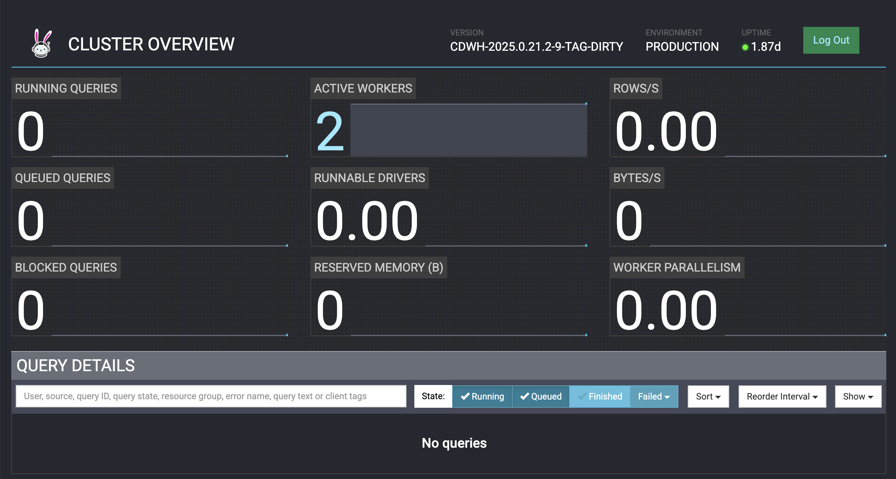

# Cloudera Iceberg REST Catalog on AWS

Let's stand up a fresh Cloudera Public Cloud (CDP) Enviornment on AWS with [`cdp-tf-quickstarts`](https://github.com/cloudera-labs/cdp-tf-quickstarts), enable the Iceberg REST Catalog embedded in the DataLake HMS, and prove end-to-end external reads from OSS Spark, AWS Athena, Snowflake, and AWS EMR Spark.  

> **Status:** 🟢 REST Catalog **live & validated** (2026-08-11) on **FTF3XR2065**. Env + DataLake + Impala Data Hub deployed, `poc_uc2.airlines` seeded, REST Catalog enabled via CM API, and the 4-step OAuth flow verified end-to-end (IDBroker-vended STS creds, `client.region=us-east-2`). Phase 5 (consumer matrix): **OSS Spark (minikube K8s), AWS EMR Spark, AWS Athena (for Spark), and Iceberg MCP (Impala) all ✅ validated**. **Pending:** **Snowflake.** Redeploy automation assigns the required env roles. Env stays up until the Friday reaper. Design confirmed against a colleague's live-run runbook.
>
> **Rebuilt 2026-08-17 (#162)** — first weekly `redeploy.sh` run against a truly reaped sandbox. AWS infra survived the reaper (terraform `0 destroyed`, 3 CDP objects recreated); `airlines` (3) + `flights` (120k) re-seeded and **both re-validated** via the 4-step REST flow. New reaper `enddate = 2026-08-21`. Fresh CRNs/share id land in `config.env`; new external users `iceberg-consumer` + `iceberg-consumer-nifi`. The NiFi re-wire leg (in the [CSO plan](cloudera-iceberg-rest-catalog-cso-plan.md)) surfaced a real bug — see the memory note `iceberg-rest-catalog-aws`.
>
> **Rebuilt `public` → `semi-private` 2026-08-18 (#179)** — destructive teardown + rebuild to co-host the CDW Trino VW (see [`cloudera-trino-plan.md`](cloudera-trino-plan.md)). Current `deployment_template = "semi-private"`. REST Catalog re-validated. Both tables (airlines + flights), both external users, and NiFi re-wire all carried forward. Trino VW (`srm-trino-vw`) added 2026-08-19 (#182). `enddate = 2026-08-28`. Reaper takes the env EOD Thursday 2026-08-21; **Monday redeploy restores full state (~1h40m `redeploy.sh` + ~15m CDW playbook)**.

This is our reproducible rebuild of the Iceberg REST Catalog API Runbook for CDP Public Cloud Runtime 7.3.2 runbook.  We will deploy the environment from scratch, add the compute Data Hub the runbook assumes, and re-verify every external consumer engine — including **EMR Spark, not yet live-verified**. It complements [`cloudera-iceberg-to-athena-plan.md`](cloudera-iceberg-to-athena-plan.md) and corrects that to be validated doc's note that "REST Catalog doesn't reach Athena" — the runbook live-verified Athena-for-Spark via the REST Catalog on 2026-07-25.

## The one thing everything hangs on

The REST service runs **inside the HMS JVM** via embedded Jetty, fronted by Knox (OAuth2 `client_credentials` → JWT; authz via Apache Ranger). It is **not** CDW. External clients hit:

```
https://<DL_GATEWAY_HOST>/<DL_NAME>/cdp-datashare-access/iceberg-rest/v1/…
```

Because the catalog lives in HMS, the metadata it can serve is exactly what HMS can serve — and the constraints below are non-negotiable.

| Constraint | Why it exists | What we do |
| :---- | :---- | :---- |
| **Runtime 7.3.2 GA** | REST Catalog / Data Sharing is a 7.3.2 GA feature | Pin `datalake_version = "7.3.2"`; verify in Mgmt Console → Data Lake → Runtime |
| **Single IDBroker only** (`CDPD-99471`) | IDBroker HA breaks credential vending | `deployment_template = "public"` → `LIGHT_DUTY` DataLake (1 IDBroker). **Never** `ENTERPRISE`/HA |
| **`CDP_DATA_SHARE_ADMIN` entitlement** | Gates the data-share feature tenant-wide | Confirm on tenant **before** Terraform (control-plane admin enables); assign `DataShareAdmin` per-env role |
| **`client.region` if bucket ≠ us-west-2** (`CDPD-91957`, `CDPD-80346`) | Clients otherwise hit us-west-2 → HTTP 301 | Add `client.region` to HMS hive-site safety valve |
| **Base SDX has no query engine** | DataLake HMS can't run CREATE/INSERT | Add an **Impala Data Hub** post-TF to seed Iceberg tables |
| **`cdp-tf-quickstarts` deploys env + DataLake only** | Repo has no `cdp_datahub` resource | Data Hub created separately via `cdp datahub create-aws-cluster` / console |

## Deployment template — `public` today, `semi-private` if CDW/Trino will share the env

This build uses `deployment_template = "public"`, and that is correct for a REST-Catalog-only env: the whole Phase 5 consumer matrix (OSS Spark, Athena, Snowflake, EMR) reaches the DataLake Knox gateway over the public internet. Keep `public` when the REST Catalog is all this env does.

**But `public` cannot host a CDW Virtual Warehouse.** CDW/EKS activation needs **private worker subnets**, and the `public` template puts workers on public subnets (`aws/main.tf`: `worker_node_subnets` = public **+** private only under `public`; private-only otherwise). Adding a CDW Trino VW to a `public`-built env is not an in-place change — it means a **destructive teardown + rebuild** of the whole environment. That is exactly what happened to `srm-iceberg` (see [`cloudera-trino-plan.md`](cloudera-trino-plan.md)).

**If this env will also host a Trino VW (or any CDW), build it `semi-private` from the start:**

- `semi-private` gives CDW its private worker subnets (+ NAT / private routing / k8s subnet tags) **while keeping the DataLake's Endpoint Access Gateway public** — so the REST Catalog consumer matrix is unaffected (public Knox front door, private compute behind it). This is not inferred: the module sets `endpoint_access_scheme = "PUBLIC"` for `semi-private` (`terraform-cdp-modules/modules/terraform-cdp-deploy/defaults.tf`). The EAG becomes an internet-facing load balancer in front of the now-private DataLake; the gateway FQDN clients use is unchanged.
- **The one real trap for the REST Catalog: keep `datalake_scale = "LIGHT_DUTY"` explicit.** The same `defaults.tf` flips the *default* scale to `ENTERPRISE` for any non-`public` template — and `ENTERPRISE` means **HA IDBroker, which breaks credential vending (CDPD-99471)** and kills the REST Catalog `load-table` vended-creds step. The tfvars already pins `LIGHT_DUTY`, so a straight swap of `deployment_template` alone is safe — but never drop that line. Keep `enable_raz = true` and `datalake_version = "7.3.2"` too. Net: the only tfvar you *change* vs. this build is `deployment_template`; the critical part is what you must *not* remove.
- Under `semi-private`, hosts get no public IPs (`use_public_ips = false`) and the plan grows ~90 → ~108 resources (NAT gateways + private routing) — more AWS cost and a longer apply/destroy. The Phase 5 SG-widening (`<knox-sg>` → `0.0.0.0/0` for Athena/Snowflake, `/32` for EMR) must be **re-resolved from the live env**: the public entry is now the EAG load balancer, so confirm which SG actually fronts 443 before assuming the old `*-knox-sg` id.
- Then follow `cloudera-trino-plan.md` for CDW activation: `private_load_balancer: true` with explicit **private** subnets for both `aws_lb_subnets` and `aws_worker_subnets`. (The CDW VW's own LB is private, so the Trino endpoint is VPC-internal — separate from the still-public REST Catalog gateway.)

> **One trap that wedges any env regardless of template:** never run `cdp environments initialize-aws-compute-cluster`. It creates an unremovable "default" externalized compute cluster and does nothing for classic CDW (`dw_cluster` provisions its own EKS). Recovery is a full env destroy + rebuild.

The public-EAG and `ENTERPRISE`-default behavior above is confirmed in the module source; the REST Catalog consumer-matrix **re-run** on the rebuilt `semi-private` `srm-iceberg` is still pending, tracked in **#179** (recreate Impala Data Hub → enable REST Catalog → seed → validate).

## External / VPC access

The `semi-private` template puts CDW workers, CDW load balancers, and DataLake compute nodes on **private subnets** (`10.10.0.0/16`). Public DNS names resolve to private IPs — unreachable from the Mac or any outside client. This affects every service in the demo suite, not just Trino (private IPs verified live 2026-08-20):

| Service | Endpoint | Resolves to | Blocked directly |
|---|---|---|---|
| **Trino VW coordinator / Web UI** | `https://srm-trino-vw.dw-srm-iceberg-cdp-env.a465-9q4k.cloudera.site:443` | `10.10.47.170`, `10.10.71.90` (private CDW NLB) | JDBC, Trino Web UI, screenshots |
| **Hue** | `https://hue-srm-trino-vw.dw-srm-iceberg-cdp-env.a465-9q4k.cloudera.site` | same private NLB | Query UI screenshots |
| **HMS thrift** | `thrift://srm-iceberg-aw-dl-master0.srm-iceb.a465-9q4k.cloudera.site:9083` | `10.10.74.221` (private) | `PutIceberg` via `HiveCatalogService` from CSO NiFi (#151) |
| **Impala workers** | private `10.10.x` IPs | — | Direct worker access (gateway host is the current workaround) |
| DL gateway (Knox) | `srm-iceberg-aw-dl-gateway.…` | `3.141.161.46` (**public**) | *not* blocked — why the REST Catalog already works |

**Solution: EC2 bastion inside the VPC + SSH dynamic SOCKS proxy** (see [#190](https://github.com/cldr-steven-matison/DesktopShare/issues/190)). The bastion's ENI has a `10.10.x` source IP that the private NLB and services already have a VPC return route to — so a browser tunnelled through it reaches all private-subnet UIs at their real hostnames, TLS/SNI and Knox redirects intact. One tunnel serves Trino UI, Hue, and any future private service.

**Live bastion (created 2026-08-20, #190):**

| Resource | Value |
|---|---|
| Instance | `i-0c5dca3ec6a24804f` — `srm-iceberg-bastion`, `t3.small`, Amazon Linux 2023 |
| Public subnet | `subnet-0e5c0f1fcae44da09` (us-east-2a, `10.10.96.0/24`; IGW-routed via `rtb-00f77e782c6d9d52f`) |
| Bastion SG | `srm-iceberg-bastion-sg` — inbound tcp/22 from the Mac's public IP `/32` only |
| Key pair | `srm-iceberg-keypair` — key on disk at `cdp-tf-quickstarts/aws/srm-iceberg-ssh-key.pem` |
| VPC | `vpc-04c815b9f35200da1` (`srm-iceberg-net`, `10.10.0.0/16`), us-east-2 |

**Why it reaches CDW:** the Trino/Hue NLB (`net/aae6dc93…`) is an internal NLB with no SG of its own; it forwards `:443` → NodePort `31137` on the EKS worker nodes, whose SG (`sg-02e19bda8692bc27a`) opens `31137` to `0.0.0.0/0`. Any in-VPC source reaches it — no CDW SG edits required. Validated 2026-08-20: from the bastion and through the SOCKS proxy from the Mac, `…/ui/` → HTTP 303 (Knox login redirect) resolving to `10.10.71.90`; Hue → 302. Trino Web UI over the SOCKS proxy from the Mac browser:



**Connect (runbook — scripts in [`iceberg-rest-catalog-demo/bastion/`](https://github.com/cldr-steven-matison/iceberg-rest-catalog-demo/tree/main/bastion)):**

```bash
cd ~/Documents/GitHub/iceberg-rest-catalog-demo/bastion
./bastion-up.sh                 # idempotent: create/start bastion, print public IP
./bastion-connect.sh <pub-ip>   # opens ssh -D 1080 SOCKS proxy (leave running)
# Browser: SOCKS5 127.0.0.1:1080, remote DNS ON (Firefox network.proxy.socks_remote_dns=true),
# then browse https://srm-trino-vw.dw-srm-iceberg-cdp-env.a465-9q4k.cloudera.site/ui/
./bastion-up.sh --stop          # stop compute billing when idle
```

The scripts resolve VPC/subnet by **Name tag**, not hardcoded ID, so they survive the weekly rebuild's new IDs. `bastion-up.sh` re-points the SSH ingress at the current Mac IP on every run.

**Survives the weekly reaper.** The bastion is a plain EC2 in the persistent VPC; the CDP reaper deletes only CDP objects (env/DataLake/Data Hub), and the weekly redeploy is `terraform apply` (not destroy), so the VPC ID is stable. Re-run `bastion-up.sh` if the reaper ever takes the instance.

**Cost:** `t3.small` ≈ $0.02/hr running; `--stop` when idle (the env auto-stops overnight anyway). No per-subnet or per-connection charges.

> **minikube / `PutIceberg` (#151) note:** a bastion does *not* transparently route the Mac's whole network stack, so minikube NiFi pods do **not** inherit VPC reachability for HMS thrift. If #151 needs pod→HMS, that's a separate path (e.g. an SSH `-L` forward the pod targets, or a NiFi-side proxy) — track it in #151, not here.

## Deployment record (this build)

Fresh environment stood up 2026-08-11 in the shared Cloudera SE sandbox tenant (control plane **us-west-1**).

| Parameter | Value |
| :---- | :---- |
| `env_prefix` | `srm-iceberg` (the 12-char cap dropped the intended `-demo`) → env `srm-iceberg-cdp-env`, DL `srm-iceberg-aw-dl` |
| AWS | profile `cldr-se` (SSO role `cldr_poweruser`), region **us-east-2** |
| `deployment_template` | `semi-private` (rebuilt 2026-08-18 #179 to co-host CDW/Trino; public EAG preserved — REST Catalog consumers unaffected) |
| `datalake_scale` / `datalake_version` | `LIGHT_DUTY` (→ single IDBroker) / `7.3.2` |
| `enable_raz` | `true` |
| Terraform | v1.14.6; quickstart cloned at `~/Documents/GitHub/cdp-tf-quickstarts`, tfvars in `aws/` |
| `cdpcli` | 0.9.163 in a dedicated venv `~/.venvs/cdpcli/` (Homebrew Python is PEP-668 externally-managed) |
| Plan size | 90 resources; VPC `srm-iceberg-net` `10.10.0.0/16` |
| Reaper | shared tenant reaps **EOD Friday weekly** — `enddate` tag = `2026-08-14` this week; bump per week to keep it alive |

**us-east-2 ≠ us-west-2**, so the `client.region` HMS safety valve (Phase 3) is *confirmed required*, not optional. The quickstart opens ingress `443/22` to the executing host's public IP only — the widen to `0.0.0.0/0` for serverless Athena/Snowflake remains a deliberate later step. Terraform auto-registers the cross-account credential and writes `srm-iceberg-ssh-key.pem` locally (do not commit).

## Deployment metrics & timeline

End-to-end from an empty AWS account to a validated Iceberg REST Catalog: **~2h wall-clock**, almost all of it CDP-side provisioning (Terraform + Data Hub). The hands-on enablement — config change, two restarts, share creation, validation — was **under 10 minutes**.

| Phase | Step | Wall-clock | Notes |
| :---- | :---- | :---- | :---- |
| 1 | `terraform apply` (90 resources) | **~1h20m** | AWS prereqs (IAM/VPC/S3) seconds–minutes; **environment 39m34s**, then **DataLake 38m15s** (sequential) |
| 2 | Impala Data Hub `srm-iceberg-impala` | **~18m** | `REQUESTED → CREATE_IN_PROGRESS → AVAILABLE` (Data Mart x86, 7.3.2) |
| 2 | Seed `poc_uc2.airlines` (3 rows) | seconds | impyla over Knox, LDAP workload auth |
| 3 | Enable REST Catalog config (CM API) | seconds | `hive_rest_catalog_enabled=true` + `client.region` |
| 3 | Restart HMS / Knox (CM API) | **~32s / ~34s** | `services/{hive,knox}/commands/restart` |
| 3 | External user + data share + activate | seconds | `datacatalog` CLI |
| 4 | 4-step OAuth validation | seconds | all green **first try** |

**Live coordinates (this build):**

| Key | Value |
| :---- | :---- |
| Environment / DataLake | `srm-iceberg-cdp-env` / `srm-iceberg-aw-dl` — RUNNING, 7.3.2, LIGHT_DUTY, **1 IDBroker** |
| DL gateway host | `srm-iceberg-aw-dl-gateway.srm-iceb.a465-9q4k.cloudera.site` |
| REST base URI | `https://<gateway>/srm-iceberg-aw-dl/cdp-datashare-access/iceberg-rest/v1/` |
| Knox token URI | `https://<gateway>/srm-iceberg-aw-dl/cdp-datashare-access/knoxtoken/api/v2/token` |
| S3 warehouse | `s3a://srm-iceberg-buk-081550c7/data/warehouse/tablespace/external/hive/` |
| Impala Data Hub | `srm-iceberg-impala` — HTTP 443, `httpPath=srm-iceberg-impala/cdp-proxy-api/impala`, LDAP `AuthMech=3` |
| External user | `iceberg-consumer` (clientId `9d4ec573-…`, `userId=13`); secret in gitignored `credentials.json` |
| Data share | `srm-iceberg-share` (id `1`, `isShared=true`, 1 asset / 1 user) |
| Working dir | [`iceberg-rest-catalog-demo`](https://github.com/cldr-steven-matison/iceberg-rest-catalog-demo) — local `~/Documents/GitHub/iceberg-rest-catalog-demo` (scripts; creds/keys gitignored) |

## Daily startup — the env auto-stops overnight ⚠️

The shared SE sandbox **auto-stops idle environments overnight** (distinct from the Friday *reaper* which deletes). So most mornings the whole stack is found `ENV_STOPPED` / DataLake `STOPPED` / Data Hub `STOPPED`, and **nothing in Phase 4/5 works until it's restarted**. This is a daily ritual, not a rebuild — the infra still exists, it's just powered down. Full teardown recovery is the separate weekly [Automated redeploy](#automated-redeploy-weekly-rebuild).

Every morning, in order (they're strictly sequential — each waits on the previous):

```bash
export PATH="$HOME/.venvs/cdpcli/bin:$PATH"; export AWS_PROFILE=cldr-se
# 0. AWS SSO token expires overnight too — interactive browser login (run yourself)
aws sso login --profile cldr-se

# 1. start the environment → brings the DataLake up with it  (~20–40m)
cdp environments start-environment --environment-name srm-iceberg-cdp-env
until [ "$(cdp datalake describe-datalake --datalake-name srm-iceberg-aw-dl | jq -r '.datalake.status')" = RUNNING ]; do sleep 30; done

# 2. Data Hub start is REJECTED until the DataLake is RUNNING (400 INVALID_ARGUMENT) — so it comes second  (~10m)
cdp datahub start-cluster --cluster-name srm-iceberg-impala
until [ "$(cdp datahub describe-cluster --cluster-name srm-iceberg-impala | jq -r '.cluster.clusterStatus')" = AVAILABLE ]; do sleep 30; done

# 3. CRNs churn on every stop/start — re-resolve into config.env before any datacatalog call
DL_CRN=$(cdp datalake describe-datalake --datalake-name srm-iceberg-aw-dl | jq -r '.datalake.crn')
ENV_CRN=$(cdp environments describe-environment --environment-name srm-iceberg-cdp-env | jq -r '.environment.crn')
printf 'ENV_CRN=%s\nDL_CRN=%s\n' "$ENV_CRN" "$DL_CRN" > ~/Documents/GitHub/iceberg-rest-catalog-demo/config.env

# 4. sanity — REST Catalog reachable end-to-end
bash ~/Documents/GitHub/iceberg-rest-catalog-demo/test-rest-catalog.sh poc_uc2 airlines
```

Gotchas that bite specifically after a stop/start (not on a fresh build):
- **Data Hub start fails while the DataLake is still coming up** — `400 INVALID_ARGUMENT … 'Datalake is stopped'`. Don't fire it early; wait for DataLake `RUNNING`.
- **CRNs are regenerated** — stale `DL_CRN`/`ENV_CRN` → `502 could not read configuration for [datalake:<crn>]`. Always re-resolve (step 3).
- **External-user credential / share** may need `cdp datacatalog regenerate-external-user-credentials` → `share-data-share` re-run if `test-rest-catalog.sh` returns `401`/`{"identifiers":[]}` (see [Dormant recovery drill](#dormant--rebuilt-sandbox-recovery-drill)).
- **Athena/Snowflake also need the knox SG re-widened** if the security group rules were reverted on the prior teardown.
- Athena doesn't need the Impala Data Hub (reads go straight through the REST Catalog); start it only when a consumer needs Impala/MCP.

## Phase 0 — Prerequisites & entitlement gate

✅ **Done 2026-08-11** — `cdpcli` + `impyla` installed in `~/.venvs/cdpcli/`, CDP + AWS auth verified, tenant surveyed. **Findings:** the pre-existing CDP API key was **deleted control-plane-side** (`NOT_FOUND` on `get-user`) and had to be regenerated; AWS auth is **SSO** (`aws sso login --profile cldr-se`, role `cldr_poweruser`). `CDP_DATA_SHARE_ADMIN` confirmed present (the `datacatalog` calls in Phase 3 succeeded).

- CDP API access key → `~/.cdp/credentials` (`cdp configure`); AWS creds via `AWS_PROFILE`.
- Local tooling: Terraform ≥ 1.5.7, `cdpcli`, `jq`, `python3`.
- Execution host: **FTF3XR2065 (Mac)** — has CDP access and is the golden-source machine; Terraform targets cloud, so this is not an on-box device survey.

## Phase 1 — Deploy env + DataLake via `cdp-tf-quickstarts`

✅ **Done 2026-08-11** — `terraform apply` created **90 resources in ~1h20m** (environment **39m34s**, then DataLake **38m15s** — sequential). DataLake `srm-iceberg-aw-dl` is RUNNING, Runtime 7.3.2, LIGHT_DUTY, **1 IDBroker** (satisfies `CDPD-99471`). `terraform plan` validated clean beforehand (90 to add, only a harmless module-internal deprecation warning).

```bash
git clone https://github.com/cloudera-labs/cdp-tf-quickstarts.git
cd cdp-tf-quickstarts/aws
cp terraform.tfvars.template terraform.tfvars    # then edit — see values below
```

Key `terraform.tfvars` values used:

```hcl
env_prefix          = "srm-iceberg"   # ≤12 chars → srm-iceberg-cdp-env / srm-iceberg-aw-dl
aws_region          = "us-east-2"
deployment_template = "semi-private"  # private worker subnets (CDW/Trino) + public EAG (REST Catalog consumers)
datalake_scale      = "LIGHT_DUTY"
datalake_version    = "7.3.2"         # REST Catalog GA
enable_raz          = true
env_tags = { owner = "steven.matison", project = "iceberg-rest-catalog-demo", enddate = "2026-08-28" }
# ↑ bump enddate each Monday redeploy (SE sandbox reaper: EOD Friday weekly)
```

Then `terraform init && terraform apply`. Capture outputs `cdp_environment_name` / `cdp_environment_crn` / `aws_vpc_id`, and pull the runbook coordinates from the live DataLake:

| Value | Where | Note |
| :---- | :---- | :---- |
| ID Broker FQDN | `describe-datalake .instanceGroups[idbroker]` | Must be exactly **one** — confirmed |
| DL gateway host | `describe-datalake .endpoints` | Use `*-aw-dl-gateway.*` (HA-safe), not `master0` |
| `client.region` | Env region | `us-east-2` → drives the Phase 3 safety valve |

## Phase 2 — Add Impala Data Hub + seed data

The base SDX DataLake has HMS but no compute. Create an Impala Data Hub, then seed the demo table.

✅ **Done 2026-08-11** — `7.3.2 - Data Mart for AWS` (x86) reached `AVAILABLE` in ~18m; seeded `poc_uc2.airlines` (3 rows) via `impyla` over Knox. **Gotchas:** seeding needs a CDP **workload password** set on the user (LDAP `AuthMech=3`); the Impala HTTP `httpPath` is read live from `cdp datahub describe-cluster` (`IMPALAD` JDBC endpoint), never hardcoded.

```bash
cdp datahub create-aws-cluster --cluster-name srm-iceberg-impala \
  --environment-name srm-iceberg-cdp-env \
  --cluster-definition-name "7.3.2 - Data Mart for AWS"
```

Seed via `seed-impala.py` (impyla, HTTP+SSL, LDAP workload auth; endpoint from `describe-cluster`). Workload password from `.workload.creds` (gitignored) or `$WORKLOAD_PASSWORD`, never the repo. Table DDL is Impala `STORED BY ICEBERG`, so it lands in HMS and the REST Catalog can serve it.


## Phase 3 — Enable the REST Catalog

✅ **Done 2026-08-11 — driven entirely through the CM API over Knox** (no UI clicks). The runbook's UI flow maps to these concrete keys/calls:

1. **Enable the service** — set Hive service config `hive_rest_catalog_enabled = true`. Supporting keys were already correct in 7.3.2: `hive_iceberg_catalog_actor_class = org.apache.iceberg.rest.HMSCatalogActor`, servlet path `icecli`, port `8090`.
2. **`client.region`** — append `<property><name>client.region</name><value>us-east-2</value></property>` to `hive_service_config_safety_valve` (**preserve** the existing properties — don't overwrite).
3. **Restart HMS, then Knox** — `POST …/services/{hive,knox}/commands/restart`, poll `GET …/commands/{id}` for `active=false, success=true`. HMS ~32s, Knox ~34s. (Knox restart makes CM-API-through-Knox calls fail mid-restart — expected; it recovers.)
4. **External user + data share** — `datacatalog` CLI (below). Activation binds a Ranger role/group to the current `clientId`.
5. **AWS SG** — Terraform already opened 443/22 to the executing host IP; the `0.0.0.0/0` widen is deferred to the serverless engines (Athena/Snowflake).

**CLI gotchas surfaced live (cdpcli 0.9.163):**
- `create-data-share --external-users` wants **`externalUserId`** as an **integer** (the `userId` field, e.g. `13`) — **not** `clientId` as the runbook's Path A example implies.
- `share-data-share` requires **`--environment-crn`** in addition to `--datalake-crn --data-share-id`; returns `{"success": true}`.
- CM API base is `…/cdp-proxy-api/cm-api/v51/…` (no `/api/` segment — Knox rewrites); HTTP basic with the workload user, which had CM admin.


## Phase 4 — Validate the REST Catalog API

✅ **Validated 2026-08-11 — all 4 steps green on the first try.** Reusable script: `test-rest-catalog.sh`.

- **1. OAuth → JWT** (POST form body, not Basic) — acquired.
- **2. namespaces** → `[default, information_schema, poc_uc2, sys]`.
- **3. tables in `poc_uc2`** → `poc_uc2.airlines` (no rotation-gotcha; Ranger bound on first activation).
- **4. load table** → **IDBroker-vended S3 STS creds** (`s3.session-token` present) and **`client.region = us-east-2`** returned — confirming the safety valve avoids `CDPD-91957`.

```bash
JWT=$(curl -sk -X POST -H "Content-Type: application/x-www-form-urlencoded" \
  -d "grant_type=client_credentials&client_id=${CLIENT_ID}&client_secret=${CLIENT_SECRET}" \
  "https://${DL_HOST}/${DL_NAME}/cdp-datashare-access/knoxtoken/api/v2/token" | jq -r '.access_token')
curl -sk -H "Authorization: Bearer ${JWT}" \
  "https://${DL_HOST}/${DL_NAME}/cdp-datashare-access/iceberg-rest/v1/namespaces"
```

**Three failure modes that look alike:** `404 "does not exist"` → seed it (Phase 2); `404 "not accessible"` → Ranger lag, wait ~60s / rebind; `{"identifiers":[]}` (no error) → rotation gotcha, re-run `share-data-share`.

## Phase 5 — Consumer matrix

🟡 **Started 2026-08-11 with OSS Spark run from the minikube/K8s cluster** (not the laptop). This matrix covers the runbook's external engines; the **NiFi and Flink/SSB** streaming consumers moved to [`cloudera-iceberg-rest-catalog-cso-plan.md`](cloudera-iceberg-rest-catalog-cso-plan.md) — where (issue #149, 2026-08-12) NiFi `InvokeHTTP` reads are ✅, the NiFi native `RESTCatalogService` block is root-caused with the fix built, and the Flink/SSB jar gap is identified; both live builds are deferred to a dedicated minikube profile (#152).

> ⚠️ **Networking prerequisite for anything outside this Mac:** the client's public **egress IP must be in the DataLake `*-knox-sg`** on 443. The minikube host and EMR have (mostly) stable IPs → add their `/32`. Serverless Athena/Snowflake egress from non-fixed AWS IPs → require `0.0.0.0/0` or PrivateLink.

| Engine | Approach | Status |
| :---- | :---- | :---- |
| **OSS Spark / PyIceberg (from K8s)** | K8s Job (`apache/spark:3.5.3`, `spark-submit --master local[*]`) in the `minikube` cluster; `--packages iceberg-spark-runtime-3.5_2.12:1.5.2,iceberg-aws-bundle:1.5.2`; catalog `type=rest`, pre-fetched Knox JWT as `.token`, `X-Iceberg-Access-Delegation: vended-credentials`, `io-impl=S3FileIO`, `client.region=us-east-2`. | ✅ **validated 2026-08-11** |
| **AWS Athena** | Athena for Apache Spark (`Spark_primary` PySpark v3 workgroup, us-east-2); same REST-catalog config as OSS Spark set via `spark.conf.set`, JWT baked into the calculation. Needs knox SG `0.0.0.0/0`. | ✅ **validated 2026-08-12** |
| **Snowflake** | Catalog Integration `TYPE = BEARER` + pre-fetched JWT (native `TYPE=OAUTH` breaks — Knox emits `expires_in` as epoch-millis). Needs a Snowflake account + SG `0.0.0.0/0`. | runbook-verified — reproduce |
| **AWS EMR Spark** | Single-node `emr-7.2.0` cluster (public subnet, default roles); Spark `local[*]` step, same REST-catalog config as OSS Spark; JWT injected over SSH (no secret in S3/step args). | ✅ **validated 2026-08-11 (first-ever)** |


### OSS Spark from K8s — ✅ validated 2026-08-11

Ran entirely **inside the `minikube` cluster** (namespace `iceberg-demo`): `Job/iceberg-rest-spark` on `apache/spark:3.5.3`, `spark-submit --master local[*]`, Iceberg packages pulled at runtime. The Knox JWT is pre-fetched on the host (2-step OAuth) and injected as a Secret (`cdp-jwt`); the PySpark script rides a ConfigMap (`spark-query`). The pod egresses via the Mac's public IP (already in the knox SG).

```python
# key catalog config — k8s/query-airlines.py
.config("spark.sql.catalog.cdp", "org.apache.iceberg.spark.SparkCatalog")
.config("spark.sql.catalog.cdp.type", "rest")
.config("spark.sql.catalog.cdp.uri", "https://<gateway>/srm-iceberg-aw-dl/cdp-datashare-access/iceberg-rest")
.config("spark.sql.catalog.cdp.token", "<pre-fetched Knox JWT>")
.config("spark.sql.catalog.cdp.header.X-Iceberg-Access-Delegation", "vended-credentials")
.config("spark.sql.catalog.cdp.io-impl", "org.apache.iceberg.aws.s3.S3FileIO")
.config("spark.sql.catalog.cdp.client.region", "us-east-2")
```

Output:

```
SHOW NAMESPACES IN cdp  →  default | information_schema | poc_uc2 | sys
SELECT * FROM cdp.poc_uc2.airlines:
  AA | American Airlines | JFK | LAX | 2026
  DL | Delta Air Lines   | ATL | SEA | 2026
  UA | United Airlines   | ORD | SFO | 2026
count(*) → 3
```

**Findings:** (1) the container ran **Java 11** and worked fine — the runbook's Java-17 pin is a *macOS-local* SecurityManager quirk, irrelevant in-cluster. (2) the `minikube` profile was **down** (Docker daemon stopped) and had to be started first. (3) the catalog `uri` omits `/v1/` (the client appends it), and the JWT goes in `.token` — Iceberg's built-in single-step OAuth won't reach Knox's 2-step endpoint. Artifacts: `k8s/query-airlines.py`, `k8s/spark-iceberg-job.yaml`.

### AWS EMR Spark — ✅ validated 2026-08-11 (first-ever)

The runbook never live-verified EMR; this build did. Single-node `emr-7.2.0` cluster in a **public** subnet (the `public` deployment template has no NAT/private subnets), default EMR roles, `srm-iceberg-keypair`. Ran the identical REST-catalog Spark config as OSS Spark via `spark-submit --master local[*]`.

- **Secret hygiene:** the JWT is fetched fresh on the Mac and **injected over SSH** into the remote `spark-submit` env — never written to S3 or EMR step args (both of those were correctly blocked by safety guardrails).
- **Networking:** added only the **primary node's `/32`** to the knox SG:443 (not `0.0.0.0/0`), and my `/32` to the EMR master SG:22 for SSH. Revoked the EMR `/32` on teardown.
- **Result:** `SHOW NAMESPACES IN cdp` → `default, information_schema, poc_uc2, sys`; `SELECT * FROM cdp.poc_uc2.airlines` → AA/DL/UA (3 rows). Cluster torn down after.
- Reproduce: ad-hoc run, no committed scripts — the PySpark body is identical to `k8s/query-airlines.py`, launched via the EMR block in [Command history](#command-history-this-build).


### AWS Athena (for Apache Spark) — ✅ validated 2026-08-12

`Spark_primary` workgroup (PySpark engine v3, us-east-2). Calculation sets the same REST-catalog config as OSS Spark via `spark.conf.set` on Athena's pre-initialized `spark` session, then queries `cdp.poc_uc2.airlines`.

- **Result:** `SHOW NAMESPACES IN cdp` → `default, information_schema, poc_uc2, sys`; `SELECT * FROM cdp.poc_uc2.airlines` → AA/DL/UA (3 rows); `count = 3`.
- **Networking:** Athena for Spark egresses from an AWS-managed VPC (no fixed IP) → knox SG opened `0.0.0.0/0:443` for the run, revoked after.
- **Secret hygiene:** fresh Knox JWT (2-step OAuth) baked into the calculation code at submit time; token TTL ~10h; template stripped to `__CDP_JWT__` in the repo.
- **Submission gotcha:** `--calculation-configuration CodeBlock=<inline>` fails on multi-line Python — pass a JSON payload (`{"CodeBlock": …}`) via `file://`.
- **Teardown (post-run):** knox SG `0.0.0.0/0:443` rule revoked (back to Mac `/32`); all Spark sessions terminated (DPU cost stops); imported console notebook deleted (removes the baked JWT). The `Spark_primary` workgroup persists at no idle cost — reused next run, not rebuilt like the EMR cluster.
- Artifacts: `athena/query-athena.py` (CLI calculation), `athena/query-athena.ipynb` (console notebook for screenshots).


## Iceberg MCP Server — AI/agent access via Impala

A second, complementary access path to the *same* Iceberg tables: the [Cloudera Iceberg MCP Server](https://github.com/cloudera/iceberg-mcp-server) gives LLMs/agents **read-only** access — but **through Impala SQL over Knox, not the REST Catalog OAuth flow**. So `srm-iceberg` demonstrates two doors to the same data: the **REST Catalog** (Spark/Athena/Snowflake, Phase 5) and **Impala + MCP** (Claude Desktop / LangChain / any MCP client). Because it rides Impala, it reuses the `srm-iceberg-impala` Data Hub from Phase 2 — **no new infra**.

- **Repo (local fork):** `~/Documents/GitHub/iceberg-mcp-server` — `origin` = `cldr-steven-matison/iceberg-mcp-server`, `upstream` = `cloudera/iceberg-mcp-server`. Python 3.13+, `uv`, `fastmcp` + `impyla`. Tools: `get_schema()` and `execute_query(query)`. Full local-install walkthrough: the blog post *How To Install Cloudera Iceberg MCP Server* (2026-05-20).
- **`.env` for our env** (points at the Data Hub Impala coordinator):

```bash
IMPALA_HOST=srm-iceberg-impala-master0.srm-iceb.a465-9q4k.cloudera.site
IMPALA_PORT=443
IMPALA_USER=steven.matison
IMPALA_PASSWORD=<workload password>          # gitignored / vault, never the repo
IMPALA_DATABASE=poc_uc2
IMPALA_HTTP_PATH=srm-iceberg-impala/cdp-proxy-api/impala   # Data Hub path — NOT the CDW default 'cliservice'
IMPALA_AUTH_MECHANISM=LDAP
IMPALA_USE_HTTP_TRANSPORT=true
IMPALA_USE_SSL=true
```

> **Finding vs. the blog:** the 2026-05-20 post targets a **CDW** Virtual Warehouse, whose `httpPath` is `cliservice`. Ours is a **Data Hub** Impala, so `IMPALA_HTTP_PATH` must be `srm-iceberg-impala/cdp-proxy-api/impala` (the exact value `seed-impala.py` already uses). Everything else matches.

- **Run / test:**

```bash
cd ~/Documents/GitHub/iceberg-mcp-server && set -a; source .env; set +a
npx @modelcontextprotocol/inspector uv run src/iceberg_mcp_server/server.py   # MCP Inspector in browser
# or wire into Claude Desktop: claude_desktop_config.json → command "uv", args ["--directory","<repo>","run","src/iceberg_mcp_server/server.py"]
```

- **✅ Validated 2026-08-11** via MCP Inspector CLI against `srm-iceberg-impala` (`tools/list` → `get_schema`, `execute_query`). Actual output:

```jsonc
// get_schema()
{"content":[{"type":"text","text":"[\"airlines\"]"}],"isError":false}

// execute_query("SELECT * FROM poc_uc2.airlines ORDER BY code")
{"content":[{"type":"text","text":
  "[[\"AA\",\"American Airlines\",\"JFK\",\"LAX\",2026],
    [\"DL\",\"Delta Air Lines\",\"ATL\",\"SEA\",2026],
    [\"UA\",\"United Airlines\",\"ORD\",\"SFO\",2026]]"}],"isError":false}
```

  CLI form: `npx -y @modelcontextprotocol/inspector --cli uv run src/iceberg_mcp_server/server.py --method tools/call --tool-name <get_schema|execute_query> [--tool-arg 'query=…']`.
- **Networking:** same knox-SG rule as the other consumers — the MCP host's egress IP must reach 443 (this Mac already allowed).
- Related Cloudera MCP servers (same install pattern): [NiFi-MCP-Server](https://github.com/cloudera/NiFi-MCP-Server), [CAI_Workbench_MCP_Server](https://github.com/cloudera/CAI_Workbench_MCP_Server), [CDV-MCP-Server](https://github.com/cloudera/CDV-MCP-Server) (`~/Documents/GitHub/CDV-MCP-Server` local).

## Dormant / rebuilt-sandbox recovery drill

After idle time nothing in Phase 4 works on the first try even when the service is healthy — it's environment drift. Work **top-down**:

1. `401 Unknown token` → OAuth credential older than the share's 30-day validity → re-create/re-activate the share.
2. `502 could not read configuration for [datalake:<crn>]` → **stale CRNs** after a rebuild → refresh `DL_CRN`/`ENV_CRN` from `cdp datalake describe-datalake` into `config.env`.
3. Impala `Knox 500 … :28000 Connection refused` → Impala daemon stopped on the Data Hub → restart Impala in CM.
4. `{"identifiers":[]}` or `404 not accessible` → Ranger lag (~1 min) or `clientId` rotation → wait/re-activate.

## Verification (definition of done)

A full `SELECT * FROM poc_uc2.airlines` returns all rows from **each** consumer: **through the REST Catalog** (IDBroker-vended STS creds) for OSS Spark (from K8s), Athena, Snowflake, and EMR; and **through Impala** for the Iceberg MCP Server. The NiFi and Flink/SSB streaming legs have their own done-condition in [`cloudera-iceberg-rest-catalog-cso-plan.md`](cloudera-iceberg-rest-catalog-cso-plan.md).

## Command history (this build)

Executed on FTF3XR2065, 2026-08-11. Secrets (`credentials.json`, `.workload.creds`, `*.pem`) are gitignored and never shown. `$DL_CRN`/`$ENV_CRN` sourced from `config.env`.

```bash
# --- Phase 0: tooling + auth ---
python3 -m venv ~/.venvs/cdpcli && ~/.venvs/cdpcli/bin/pip install cdpcli impyla
cdp configure                                   # fresh CDP API key (old one deleted control-plane-side)
aws sso login --profile cldr-se; export AWS_PROFILE=cldr-se
cdp iam get-user; aws sts get-caller-identity
cdp environments list-environments              # tenant survey (shared SE sandbox)

# --- Phase 1: deploy env + DataLake ---
git clone https://github.com/cloudera-labs/cdp-tf-quickstarts.git && cd cdp-tf-quickstarts/aws
#   wrote terraform.tfvars (srm-iceberg / public / LIGHT_DUTY / 7.3.2 / us-east-2)
terraform init && terraform apply -auto-approve
cdp datalake describe-datalake --datalake-name srm-iceberg-aw-dl   # gateway host, IDBroker=1, RUNNING

# --- Phase 2: Impala Data Hub + seed ---
cdp datahub create-aws-cluster --cluster-name srm-iceberg-impala \
  --environment-name srm-iceberg-cdp-env --cluster-definition-name "7.3.2 - Data Mart for AWS"
cdp datahub describe-cluster --cluster-name srm-iceberg-impala     # IMPALAD httpPath
python seed-impala.py sql/seed-airlines.sql                        # → poc_uc2.airlines, 3 rows

# --- Phase 3: enable REST Catalog (CM API over Knox) ---
CMAPI=https://<gateway>/srm-iceberg-aw-dl/cdp-proxy-api/cm-api
curl -u steven.matison:$PW "$CMAPI/v51/clusters/srm-iceberg-aw-dl/services/hive/config?view=full"  # find keys
curl -u ... -X PUT -d @hive-cfg.json "$CMAPI/v51/.../services/hive/config"   # rest_catalog_enabled=true + client.region
curl -u ... -X POST "$CMAPI/v51/.../services/hive/commands/restart"          # HMS ~32s
curl -u ... -X POST "$CMAPI/v51/.../services/knox/commands/restart"          # Knox ~34s
cdp datacatalog create-external-users --datalake-crn $DL_CRN --environment-crn $ENV_CRN \
  --external-users '[{"username":"iceberg-consumer","email":"...","companyName":"Cloudera"}]'
cdp datacatalog create-data-share --datalake-crn $DL_CRN --environment-crn $ENV_CRN \
  --data-share-name srm-iceberg-share --assets '[{"databaseName":"poc_uc2","tableName":"airlines"}]' \
  --external-users '[{"externalUserId":13}]'          # NOTE: integer externalUserId, NOT clientId
cdp datacatalog share-data-share --datalake-crn $DL_CRN --environment-crn $ENV_CRN --data-share-id 1

# --- Phase 4: validate ---
bash test-rest-catalog.sh poc_uc2 airlines            # JWT → namespaces → tables → vended-creds metadata

# --- Phase 5: consumers (all region us-east-2; each needs a fresh 2-step-OAuth JWT) ---
JWT=$(curl -sk -X POST -H "Content-Type: application/x-www-form-urlencoded" \
  -d "grant_type=client_credentials&client_id=$CLIENT_ID&client_secret=$CLIENT_SECRET" \
  "https://<gateway>/srm-iceberg-aw-dl/cdp-datashare-access/knoxtoken/api/v2/token" | jq -r .access_token)

#  OSS Spark on minikube (namespace iceberg-demo) — Mac IP already in knox SG
kubectl create namespace iceberg-demo
kubectl -n iceberg-demo create secret generic cdp-jwt --from-literal=token="$JWT"
kubectl -n iceberg-demo create configmap spark-query --from-file=query-airlines.py=k8s/query-airlines.py
kubectl -n iceberg-demo apply -f k8s/spark-iceberg-job.yaml   # apache/spark:3.5.3, spark-submit local[*]
kubectl -n iceberg-demo logs -f job/iceberg-rest-spark        # → namespaces, AA/DL/UA, count 3

#  AWS EMR Spark (single-node emr-7.2.0, public subnet, default roles) — torn down after
aws emr create-cluster --release-label emr-7.2.0 --applications Name=Spark --use-default-roles \
  --instance-count 1 --ec2-attributes KeyName=srm-iceberg-keypair,SubnetId=<public-subnet>
aws ec2 authorize-security-group-ingress --group-id <knox-sg> --protocol tcp --port 443 --cidr <emr-primary-ip>/32
ssh -i srm-iceberg-keypair.pem hadoop@<emr-primary-dns> \
  "CDP_JWT=$JWT spark-submit --master local[*] --packages <iceberg-pkgs> query-emr.py"   # JWT over SSH, never S3/step args
aws ec2 revoke-security-group-ingress --group-id <knox-sg> ... ; aws emr terminate-clusters --cluster-ids <j-id>

#  AWS Athena for Apache Spark (Spark_primary workgroup) — SG widened for the run, reverted after
aws ec2 authorize-security-group-ingress --group-id <knox-sg> \
  --ip-permissions 'IpProtocol=tcp,FromPort=443,ToPort=443,IpRanges=[{CidrIp=0.0.0.0/0}]'
sed "s|__CDP_JWT__|$JWT|" athena/query-athena.py > /tmp/calc.py
jq -n --rawfile code /tmp/calc.py '{CodeBlock:$code}' > /tmp/calc.json    # inline CodeBlock= breaks on multiline py
SID=$(aws athena start-session --work-group Spark_primary \
  --engine-configuration '{"CoordinatorDpuSize":1,"MaxConcurrentDpus":2,"DefaultExecutorDpuSize":1}' | jq -r .SessionId)
CALC=$(aws athena start-calculation-execution --session-id "$SID" \
  --calculation-configuration file:///tmp/calc.json | jq -r .CalculationExecutionId)
aws athena get-calculation-execution --calculation-execution-id "$CALC"    # poll → COMPLETED
aws s3 cp "$(aws athena get-calculation-execution --calculation-execution-id "$CALC" | jq -r .Result.StdOutS3Uri)" -
aws athena terminate-session --session-id "$SID"                           # stop DPU cost
aws ec2 revoke-security-group-ingress --group-id <knox-sg> --security-group-rule-ids <sgr-id>
```

## Automated redeploy (weekly rebuild)

The shared tenant reaps **EOD Friday**, so the whole stack is disposable and must be reproducible on demand — e.g. **Monday morning**. `redeploy.sh` (authoritative copy in [`iceberg-rest-catalog-demo`](https://github.com/cldr-steven-matison/iceberg-rest-catalog-demo)) chains every phase end-to-end: **~1h40m, unattended after two interactive prereqs.** After it completes, run the CDW Ansible playbook to restore the Trino VW (~15m — see [`cloudera-trino-plan.md`](cloudera-trino-plan.md) Monday redeploy checklist).

**Interactive prereqs (once, before running):**
```bash
aws sso login --profile cldr-se          # SSO browser login
cdp configure                            # only if the CDP API key was rotated/deleted
# ~/Documents/GitHub/iceberg-rest-catalog-demo/.workload.creds must hold the workload password
```

Then: `bash ~/Documents/GitHub/iceberg-rest-catalog-demo/redeploy.sh`

**What `redeploy.sh` does (8 steps):**
1. `terraform apply` — rebuild env + DataLake (~1h20m); `deployment_template = "semi-private"` in tfvars
2. Wait DataLake RUNNING; resolve fresh CRNs into `config.env`; assign resource roles (idempotent)
3. Create Impala Data Hub + wait AVAILABLE (~18m) — Impala is still required for seeding (not Trino)
4. Seed `poc_uc2.airlines` (3 rows) + `poc_uc2.flights` (120k rows, 12 monthly partitions)
5. Enable REST Catalog (`hive_rest_catalog_enabled=true`, `client.region=us-east-2` safety valve); restart HMS then Knox
6. Create two external users (`iceberg-consumer` + `iceberg-consumer-nifi`); share both tables to both users; activate; write fresh `credentials.json` + `credentials-nifi.json`
7. Validate REST Catalog: `test-rest-catalog.sh poc_uc2 airlines` + `poc_uc2.flights`
8. Best-effort NiFi re-wire: updates the Parameter Context on the surviving `iceberg-lab` minikube flow with the new `iceberg-consumer-nifi` creds; prints manual steps if the `nifi-client` pod is not running

Stable across rebuilds: gateway host (`srm-iceberg-aw-dl-gateway.srm-iceb.a465-9q4k.cloudera.site`) and the MCP `.env` are fixed for this tenant + prefix. **Only the CRNs churn** — the script re-resolves them.

## Resources

- **This plan's scripts:** [cldr-steven-matison/iceberg-rest-catalog-demo](https://github.com/cldr-steven-matison/iceberg-rest-catalog-demo) — `test-rest-catalog.sh`, `redeploy.sh`, `seed-impala.py`, and the `athena/`, `flink/`, `k8s/`, `nifi/`, `sql/` dirs (creds/keys gitignored)
- Colleague runbook: *Iceberg REST Catalog API Runbook* (Runtime 7.3.2, live-run on `zzengaws732-aw-dl`)
- Deploy: [cloudera-labs/cdp-tf-quickstarts](https://github.com/cloudera-labs/cdp-tf-quickstarts)
- **Iceberg MCP Server (Cloudera root repo):** [cloudera/iceberg-mcp-server](https://github.com/cloudera/iceberg-mcp-server) — fork [cldr-steven-matison/iceberg-mcp-server](https://github.com/cldr-steven-matison/iceberg-mcp-server), local `~/Documents/GitHub/iceberg-mcp-server`
- **MCP install guide (blog):** [How To Install Cloudera Iceberg MCP Server](https://stevenmatison.com/blog/How-To-Install-Cloudera-Iceberg-MCP-Server/)
- **K8s testing home:** [cldr-steven-matison/ClouderaStreamingOperators](https://github.com/cldr-steven-matison/ClouderaStreamingOperators) — where the in-cluster (minikube `minikube` default profile) consumer tests for this plan will live
- [Configuring Hive Metastore as a REST Catalog (7.3.2)](https://docs.cloudera.com/runtime/7.3.2/using-cloudera-data-sharing/topics/cr-ds-configuring-hive-metastore-rest-catalog.html)
- [Access data using REST Catalog APIs (7.3.2)](https://docs.cloudera.com/runtime/7.3.2/using-cloudera-data-sharing/topics/cr-ds-access-data-using-rest-catalog-apis.html)
- [Known issues in Iceberg REST Catalog (7.3.2)](https://docs.cloudera.com/runtime/7.3.2/public-release-notes/topics/rt-known-issues-iceberg-REST-catalog.html)
