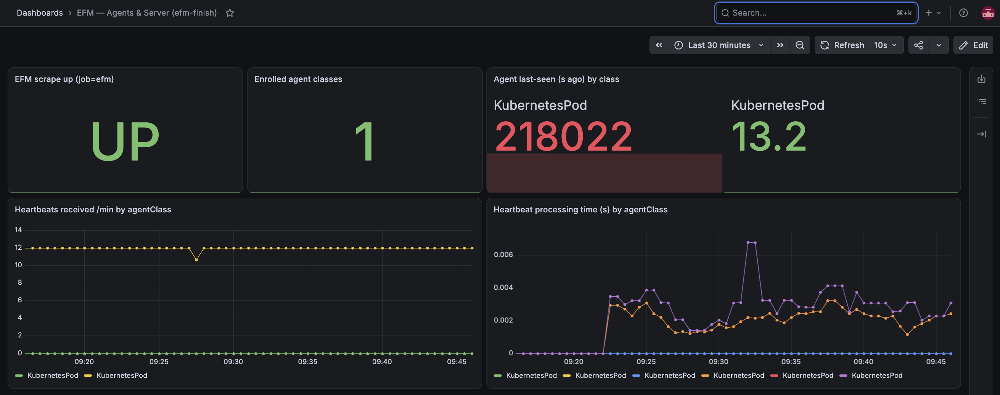

# efm-finish — from-scratch CSO → EFM → Grafana rebuild plan

**Device:** FTF3XR2065 (Mac, M4 Pro, arm64) · **Issue:** [#168](https://github.com/cldr-steven-matison/DesktopShare/issues/168) · **Under:** EPIC [#137](https://github.com/cldr-steven-matison/DesktopShare/issues/137) (work-streams B & C, EFM → observability)

## Why this exists

WindowsDesktop is closing in on end-to-end EFM-agents-in-Grafana, and the last #137 phases are
field-testing + screenshots. The `minikube` golden profile on this Mac is 123+ days old and has
drifted (RAG stack scaled to 0, EFM toggled up/down for #163, etc.). Rather than screenshot a
drifted cluster, this plan stands up a **brand-new, dedicated profile — `efm-finish` — from
scratch**, purpose-built to carry the whole CSO stack cleanly through to a Grafana panel showing
live EFM/MiNiFi agent metrics.

**The end state that "done" means:** a MiNiFi agent enrolled in a freshly-built EFM, its metrics
scraped by the in-cluster Prometheus, and a Grafana panel rendering `up{job="efm"}=1` plus
`agentClass`-tagged agent series — clean enough to screenshot for the guide.

## Ground truth captured at plan time (2026-08-14)

- `minikube profile list`: **`iceberg-lab` is the ACTIVE/running profile** (`192.168.67.2`);
  `minikube` (the golden CSO stack, `192.168.49.2`) is **Stopped**; `s2s-lab` Stopped. `efm-finish`
  does not exist yet.
- Host RAM is **nearly maxed** (`47G used, 772M unused`) with iceberg-lab running. **You cannot
  start a second heavy profile alongside iceberg-lab** — Phase 0 stops it first (recoverable).
- minikube **v1.37.0**, docker driver, k8s **v1.34.0**. kubectl v1.35.0.
- All manifests referenced below live in the sibling repo
  `~/Documents/GitHub/ClouderaStreamingOperators/` (the golden-source yamls) and the bootstrap
  scripts in `~/Documents/GitHub/DesktopShare/files/`. Confirmed present at plan time.

## The non-negotiables (read before running anything)

These are distilled from prior incidents — see `agent/incident-rules.md`, `efm-metrics.md`, and the
`nifi-and-ai` skill. They cost real time each. In this plan they show up inline at the phase that
trips them; collected here so they're read once up front:

1. **EFM Prometheus metrics are on port `10090` at `/efm/actuator/prometheus` — NOT port `9092`.**
   The `metrics/9092` port in the Service accepts TCP but returns empty. The ServiceMonitor must
   scrape `port: efm-ui`. (`efm-metrics.md`, field-verified 2026-07-29.)
2. **Never reuse a MiNiFi `agentIdentifier` across a *new* enrollment, and never hand-build the
   deployer command.** The `minifi-agent-pod-arm64.yaml` carries a hardcoded UUID — that is
   **safe here only because `efm-finish` has a brand-new empty EFM Postgres DB**, so there is no
   prior registration to collide with. If you ever re-enroll or add a second class, get a fresh
   command from EFM's Deploy Agent screen / `POST /efm/api/agent-deployer/generateCommand` (omit
   `agentIdentifier`). (`agent/incident-rules.md` "EFM agent deployment", `efm-agent-deployer-command` memory.)
3. **EFM's image ships no `curl`.** Health-check it via a host port-forward, never `kubectl exec`.
4. **CSA's SSB Postgres image is VPN-only** (`docker-private.infra.cloudera.com`). The CSA install
   must override it to `container.repository.cloudera.com/cloudera_thirdparty/hardened/postgres`
   or the deploy hangs on ImagePullBackOff. **Bring the Cloudera VPN up before Phase 5.**
5. **Every `kubectl` / `minikube` / `docker-env` / `tunnel` / `service` command must be profile-scoped.**
   After `minikube start -p efm-finish` run `kubectl config use-context efm-finish` — then verify
   context on every step (`kubectl config current-context`). A command that silently runs against
   the wrong profile is the classic profile-swap footgun (`Disposable Clusters on One Box` blog).
6. **Confirm before every restart/redeploy of a live service; check for an already-running
   port-forward before starting one.** Standard fleet discipline — applies even on a throwaway
   profile once a MiNiFi agent is heart-beating a live flow.

## Dependency chain (why the order is what it is)

```
minikube efm-finish
  └─ cert-manager ──────────────► (issuers for NiFi TLS)
       └─ namespaces + secrets
            ├─ CSM/Strimzi ──► Kafka CRs (w/ JMX metrics)
            ├─ CSA/Flink ────► ssb-postgresql  ◄── EFM's DB lives here (create `efm` DB in it)
            ├─ CFM operator ─► Nifi CR (mynifi-0)
            ├─ Schema Registry + Surveyor
            └─ kube-prometheus-stack (Prometheus + Grafana, into cld-streaming)
                 └─ EFM (needs ssb-postgresql up first)  ── stage agent binaries into PVC
                      └─ MiNiFi agent pod (arm64) self-enrolls  ── "something to measure"
                           └─ ServiceMonitors/PodMonitors + dashboards ──► Grafana panel ✅
```

The one non-obvious edge: **EFM's persistence DB is `ssb-postgresql` (from CSA)** —
`EF_DB_URL=jdbc:postgresql://ssb-postgresql.cld-streaming.svc:5432/efm`. So CSA (or at least its
Postgres) must be up, and the `efm` database + user created in it, **before** EFM starts. That is
why CSA is not optional here even though the headline goal is EFM.

---

## Phase 0 — Preflight (do not skip)

```bash
# 1. Cloudera VPN up (needed for some operator/image pulls, esp. CSA postgres). Confirm:
ifconfig utun 2>/dev/null | grep -q "corp-vpn" && echo "VPN up" || echo "START THE VPN FIRST"

# 2. Free RAM — stop the running iceberg-lab profile (RECOVERABLE, not delete):
minikube stop -p iceberg-lab
#    Golden `minikube` profile is already Stopped — leave it. Do NOT `minikube delete` anything.

# 3. Docker Desktop VM must be sized >= what efm-finish will request (see Phase 1).
#    Check Docker Desktop → Settings → Resources → Memory >= 26 GB. The docker driver can only
#    hand minikube as much as the Docker VM has.

# 4. Cloudera Helm registry login (OCI charts):
helm registry login container.repository.cloudera.com   # Cloudera creds

# 5. Sanity: which profiles / contexts exist
minikube profile list
```

**RAM sizing decision:** the golden scripts use `--memory 16384 --cpus 6`, but that shape
OOM-killed `mynifi-0` once at 122% overcommit (CLAUDE-CHECKIN, 2026-07-29) — and that was
*without* Prometheus+Grafana+EFM all healthy simultaneously, which is exactly what screenshots
need. With iceberg-lab stopped there is headroom. **Recommend `--memory 24576 --cpus 8`** for
`efm-finish` (bump Docker Desktop VM to ≥26 GB to match). Fall back to 20480 if Docker VM can't
give 26 GB.

## Phase 1 — Start the profile

```bash
minikube start -p efm-finish --driver=docker --cpus 8 --memory 24576 --kubernetes-version=v1.34.0
kubectl config use-context efm-finish          # NON-NEGOTIABLE (footgun #5)
kubectl config current-context                  # must print: efm-finish
minikube -p efm-finish addons enable ingress
minikube -p efm-finish addons enable metrics-server
```

Reference: `blog/Disposable Clusters on One Box - The minikube Profile Swap.md`,
`files/agent-minikube-reset.sh` (the addons-enabling variant).

## Phase 2 — cert-manager

```bash
helm repo add jetstack https://charts.jetstack.io && helm repo update
helm install cert-manager jetstack/cert-manager \
  --version v1.16.3 --namespace cert-manager --create-namespace --set installCRDs=true
kubectl rollout status deploy/cert-manager-webhook -n cert-manager --timeout=180s
```

## Phase 3 — Namespaces + secrets

```bash
kubectl create namespace cld-streaming
kubectl create namespace cfm-streaming

# License + registry + NiFi admin secrets (values from the golden scripts / your creds):
#   cfm-operator-license (cfm-streaming), cloudera-creds (both ns), nifi-admin-creds (cfm-streaming)
```

Use `files/setup-cloudera-streaming.sh` / `files/agent-install-operators.sh` as the source of the
exact `kubectl create secret` lines and `--set` flags — **do not hand-retype them.** NiFi admin
secret is `username=admin, password=$NIFI_ADMIN_PASS`.

## Phase 4 — CSM / Strimzi (Kafka) with JMX metrics

```bash
helm install strimzi-cluster-operator -n cld-streaming \
  oci://container.repository.cloudera.com/cloudera-helm/csm-operator/strimzi-kafka-operator \
  --version 1.6.0-b99 --set watchAnyNamespace=true

cd ~/Documents/GitHub/ClouderaStreamingOperators
# Use the PROMETHEUS variant of the Kafka CR so JMX metrics are wired from first boot:
kubectl apply -f kafka-metrics-config.yaml -n cld-streaming     # JMX -> Prometheus rule set
kubectl apply -f kafka-nodepool.yaml       -n cld-streaming
kubectl apply -f kafka-eval-prometheus.yaml -n cld-streaming    # Kafka CR w/ jmxPrometheusExporter
kubectl rollout status statefulset/my-cluster-combined -n cld-streaming --timeout=600s || \
  kubectl get pods -n cld-streaming | grep my-cluster
```

Wiring metrics in at CR-apply time avoids a later rolling restart of Kafka (the reason CSM
observability was *skipped* on the golden cluster — see `efm-windowsdesktop-prometheus-grafana.md`).

## Phase 5 — CSA / Flink (provides ssb-postgresql, EFM's DB) — VPN REQUIRED

```bash
cd ~/Documents/GitHub/ClouderaStreamingOperators
helm install csa-operator -n cld-streaming \
  oci://container.repository.cloudera.com/cloudera-helm/csa-operator/csa-operator \
  --version 1.5.0-b275 \
  --values ./csa-prometheus-values.yaml \
  --set 'ssb.database.image.repository=container.repository.cloudera.com/cloudera_thirdparty/hardened/postgres'
```

- The `--values csa-prometheus-values.yaml` injects the Flink PrometheusReporterFactory on port
  9249 **at install time** (later injection needs a restart).
- The `--set ssb.database.image...` is the **VPN-only-image fix** (non-negotiable #4).
- Wait for `ssb-postgresql` to be `Running` — EFM in Phase 9 depends on it.

## Phase 6 — CFM operator + NiFi CR

```bash
cd ~/Documents/GitHub/ClouderaStreamingOperators
helm install cfm-operator -n cfm-streaming \
  oci://container.repository.cloudera.com/cloudera-helm/cfm-operator/cfm-operator \
  --version 3.0.0-b126 --set installCRDs=true
#   (agent-install-operators.sh carries the authProxy.image.* --set flags — reuse them verbatim)

kubectl apply -f cluster-issuer.yaml                              # ClusterIssuer FIRST
kubectl apply -f nifi-cluster-30-nifi2x.yaml -n cfm-streaming     # Nifi CR (single-user auth)
kubectl apply -f nifi-combined.yaml                              # ingress + supporting
kubectl rollout status statefulset/mynifi -n cfm-streaming --timeout=600s
```

NiFi CR: image `cfm-nifi-k8s:3.0.0-b126-nifi_2.6.0.4.3.4.0-234`, `replicas: 1`,
`singleUserAuth.enabled: true` (`nifi-admin-creds`), cert from `cfm-operator-ca-issuer-signed`.
If you want durable NiFi state for repeat screenshots, use `nifi-cluster-32-nifi2x-pvc.yaml`
instead (5 repo PVCs + Python-extensions PVC) — see `blog/Persistence with Cloudera Flow Management Operator.md`.

## Phase 7 — Schema Registry + Surveyor (completes "full stack")

```bash
helm install schema-registry -n cld-streaming \
  oci://container.repository.cloudera.com/cloudera-helm/csm-operator/schema-registry \
  --version 1.6.0-b99 --values ./sr-values.yaml
helm install cloudera-surveyor -n cld-streaming \
  oci://container.repository.cloudera.com/cloudera-helm/csm-operator/surveyor --version 1.6.0-b99
```

Not on the EFM→Grafana critical path, but part of the whole CSO stack for a faithful rebuild.
Skip if RAM is tight and you only need the EFM observability shot.

## Phase 8 — Prometheus + Grafana (kube-prometheus-stack, into cld-streaming)

```bash
helm repo add prometheus-community https://prometheus-community.github.io/helm-charts && helm repo update
helm install prometheus prometheus-community/kube-prometheus-stack -n cld-streaming \
  --set prometheus.prometheusSpec.serviceMonitorSelectorNilUsesHelmValues=false \
  --set prometheus.prometheusSpec.podMonitorSelectorNilUsesHelmValues=false
```

- **Install into `cld-streaming`, NOT a separate `monitoring` namespace** — this is the
  field-correction over the AI-drafted `completed/cso-minikube-prometheus.md` (which used
  `monitoring`). The exact `--set` block for cross-namespace ServiceMonitor/PodMonitor discovery
  is in `blog/Observability with Cloudera Streaming Operators.md`.
- Grafana admin password:
  ```bash
  kubectl get secret -n cld-streaming -l app.kubernetes.io/component=admin-secret \
    -o jsonpath="{.items[0].data.admin-password}" | base64 --decode
  ```

## Phase 9 — EFM (the point of all this)

```bash
# 9a. Create the EFM database + user inside the SSB Postgres (from Phase 5):
kubectl exec -it ssb-postgresql-0 -n cld-streaming -- psql -U postgres -c \
  "CREATE DATABASE efm;"
#   then CREATE USER efm WITH PASSWORD '...'; GRANT ... — exact SQL in blog/efm-persistance.md Phase 2

# 9b. EFM secrets (efm-db-pass key=password, efm-encryption key=encryption.password) — efm-persistance.md
# 9c. Apply EFM config + storage + deployment:
cd ~/Documents/GitHub/ClouderaStreamingOperators
kubectl apply -f efm-configMap.yaml -n cld-streaming     # includes the metrics properties block (below)
kubectl apply -f efm-pvc.yaml       -n cld-streaming     # efm-agent-binaries 2Gi + efm-resources 1Gi
kubectl apply -f efm-deployment-persisted.yaml -n cld-streaming

# 9d. Health check via HOST PORT-FORWARD (image has no curl — non-negotiable #3):
kubectl port-forward -n cld-streaming deploy/efm 10190:10090 &
curl http://localhost:10190/efm/actuator/health          # expect {"status":"UP"}
```

The `efm-configMap.yaml` **must** contain these for Prometheus to work (verify — non-negotiable #1):

```properties
management.prometheus.metrics.export.enabled=true
management.metrics.efm.enabled=true
management.metrics.efm.enableTag.agentClass=true
management.metrics.efm.enableTag.agentId=true
```

Full ordered EFM runbook incl. cold-start recovery: `blog/efm-persistance.md`.

## Phase 10 — Stage agent binaries + enroll a MiNiFi agent (something to measure)

On a fresh EFM the `efm-agent-binaries` PVC is **empty**, so the agent-deployer has nothing to
serve. Two things happen here:

```bash
# 10a. Stage the MiNiFi agent binary into EFM's binaries PVC / agent-deployer.
#      Recipe: efm-binaries.md (and efm-binaries-manual-deliver.md for the kubectl cp path).

# 10b. Deploy the arm64 MiNiFi pod — it self-enrolls after EFM health passes:
kubectl apply -f ~/Documents/GitHub/ClouderaStreamingOperators/minifi-agent-pod-arm64.yaml
#   Class KubernetesPod. The hardcoded agentIdentifier is SAFE here (fresh EFM DB, non-negotiable #2).
#   The pod polls http://efm.cld-streaming.svc:10090/efm/actuator/health then curls agent-deployer/script.
```

Once it heart-beats, EFM's `/efm/actuator/prometheus` gains `agentClass="KubernetesPod"`-tagged
series — that is the data the Grafana panel will show. (`efm-metrics.md` "Deploy an agent so
there's something to measure".)

Optional deeper metrics: the MiNiFi **C++ native Prometheus publisher** on port 9936
(`nifi.metrics.publisher.*`, needs `libminifi-prometheus.so` in `extensions/`) — `efm-metrics.md`
Layer 2. Not required for the headline EFM-server-metrics shot.

## Phase 11 — ServiceMonitors / PodMonitors + dashboards

```bash
cd ~/Documents/GitHub/ClouderaStreamingOperators
kubectl apply -f efm-service-monitor.yaml    -n cld-streaming   # scrapes port efm-ui /efm/actuator/prometheus
kubectl apply -f nifi-service-monitor.yaml   -n cfm-streaming   # mTLS + SNI relabel gotcha baked in
kubectl apply -f csa-flink-service.yaml      -n cld-streaming   # headless svc for Flink 9249
kubectl apply -f csa-flink-service-monitor.yaml -n cld-streaming
# Strimzi PodMonitor (Kafka 9404) — strimzi-pod-monitor.yaml per blog/cso-minikube-prometheus-csm.md
```

Import dashboards into Grafana (JSON already in the CSO repo):
- `cso-fraud-dashboard.json` (end-to-end NiFi/Kafka/Flink)
- `csa-flink-dashboard.json`, `csm-kafka-dashboard.json`
- EFM panel: build from `up{job="efm"}` + `efm_*` series tagged `agentClass` (see `efm-metrics.md`;
  WindowsDesktop's #137 work-stream B/C is the reference for the exact panel).

## Phase 12 — Verify + screenshot (definition of done)

```bash
# Prometheus targets healthy:
#   up{job="efm"}=1 , up{job="mynifi-web"}=1 , Kafka/Flink targets up
# EFM agent series present:
#   efm_*{agentClass="KubernetesPod"} returns data
```

- In Grafana: EFM panel renders the enrolled agent's live metrics → **screenshot for #137**.
- Confirm the MiNiFi pod shows `status: RUNNING` in the EFM UI (`http://localhost:<fwd>/efm/`).



## Phase 13 — Port-forwards, wrap-up, teardown/restore

- Bring up the canonical port-forward set **profile-scoped** (all `--address 0.0.0.0` per this
  Mac's convention): `efm 10090`, `prometheus-grafana 3000`, `kafka-bootstrap 9092`, NiFi web.
  **Check for an already-running forward before starting one** (non-negotiable #6). Reuse the
  zellij `kube-service-ports-efm.kdl` layout, adjusting context to `efm-finish`.
- **Doc updates when this lands** (workflow rule — a plan that ships must update its docs):
  - Add an `efm-finish` note to this Mac's block in `CLAUDE-CHECKIN.md` (what's running, ports,
    teardown line).
  - Update EPIC #137 work-streams B & C with the screenshot artifacts; flip tracker rows for
    Ch19/Ch21 as their observability evidence lands.
  - Comment on #168 with the result + commit sha, then `status:review`.
- **Teardown / restore (recoverable):**
  ```bash
  minikube stop -p efm-finish        # keep it on disk for re-screenshotting, OR
  minikube delete -p efm-finish      # permanent, when fully done
  minikube start -p iceberg-lab      # bring the iceberg work back if needed
  ```

## Source map (walk the ladder, don't re-derive)

| Need | Source |
|---|---|
| Profile create/swap flags, footguns | `blog/Disposable Clusters on One Box - The minikube Profile Swap.md`, `files/agent-minikube-reset.sh` |
| Full operator install order + exact `--set` flags | `~/Documents/GitHub/ClouderaStreamingOperators/README.md`, `files/setup-cloudera-streaming.sh`, `files/agent-install-operators.sh` |
| EFM deploy + persistence + cold-start | `blog/efm-persistance.md`; manifests `efm-deployment-persisted.yaml`, `efm-configMap.yaml`, `efm-pvc.yaml` |
| EFM→Prometheus→Grafana path, the 9092/10090 gotcha | `efm-metrics.md`, `efm-windowsdesktop-prometheus-grafana.md`, `efm-service-monitor.yaml` |
| Per-operator observability recipes | `blog/cso-minikube-prometheus-{cfm,csa,csm}.md`, `blog/Observability with Cloudera Streaming Operators.md` |
| NiFi CR / persistence | `nifi-cluster-30-nifi2x.yaml` / `nifi-cluster-32-nifi2x-pvc.yaml`, `blog/Persistence with Cloudera Flow Management Operator.md` |
| MiNiFi agent enrollment on K8s | `minifi-agent-pod-arm64.yaml`, `minifi-playground-efm-level2.md`, `nifi-and-ai` skill `references/minifi-efm.md` |
| Agent binary staging into EFM | `efm-binaries.md`, `efm-binaries-manual-deliver.md` |
| Dashboards (import-ready JSON) | `cso-fraud-dashboard.json`, `csa-flink-dashboard.json`, `csm-kafka-dashboard.json` (CSO repo) |
| Teardown | `files/uninstall-cloudera-streaming.sh`, `files/agent-helm-uninstall.sh` |

## Uncertainties for the executing session to resolve live

- **Exact chart build versions may have moved** since the README was written (strimzi `1.6.0-b99`,
  csa `1.5.0-b275`, cfm `3.0.0-b126`). Confirm against the CSO repo README / a `helm search` at run
  time — live state outranks this doc.
- **CSA install is the most failure-prone step** (VPN + image override). If it stalls, the fallback
  is a standalone minimal Postgres for EFM instead of `ssb-postgresql` — but that diverges from the
  golden shape, so prefer fixing CSA.
- **RAM headroom is the gating risk.** If the full stack + observability won't fit even with
  iceberg-lab stopped, drop Phase 7 (Schema Registry/Surveyor) first, then consider skipping the
  Flink/Kafka dashboards — the EFM→Grafana shot only strictly needs Phases 1–4 (for the ns/Kafka
  it doesn't even need Kafka), 5 (Postgres only), 6 (optional), 8, 9, 10, 11(EFM monitor only), 12.

---

## As-built — executed 2026-08-14/15 (this ran successfully end-to-end)

The plan ran clean to a live EFM→Grafana chain. Result: **every pod Running**, Prometheus
`up{job="efm"}=1`, `up{job="mynifi-web"}=1`, Kafka `strimzi-pod-monitor` 3/3 up, **1081 `efm_*`
series** scraped, and **28 series tagged `agentClass="KubernetesPod"`** (the enrolled MiNiFi
agent — `efm_heartbeat_count_total`, `efm_heartbeat_lastSeenTime_seconds`,
`efm_heartbeat_time_seconds`, …). Node sat at **44% memory / 4% CPU** on the 24 GB profile.
Grafana dashboard **"EFM — Agents & Server (efm-finish)"** (`/d/as58zd`) + the three CSO
dashboards (Fraud/Flink/Kafka) are imported and live.

Deviations from the plan-as-written, fold these back in for the next rebuild:

1. **Docker VM was already 32 GB** (`MemoryMiB: 32512`) — no bump needed; 26 GB would have been a
   *downgrade*. Check the current value before changing it.
2. **`cloudera-creds`** was lifted from the stopped golden `minikube` profile
   (`kubectl get secret … -o jsonpath='{.data.\.dockerconfigjson}'`) — the Mac's Docker cred store
   (`credsStore: desktop`) keeps the password out of `~/.docker/config.json`, so it can't be minted
   from disk. Start golden briefly, copy the secret, stop it.
3. **`nifi-combined.yaml` conflicts with the operator in CFM 3.0.0-b126.** The operator creates its
   own `mynifi-web` ingress; the manual `mynifi-ingress` in `nifi-combined.yaml` has the identical
   host+path, so nginx's admission webhook rejects the operator's ingress and the reconcile
   **hard-fails before the StatefulSet** (`DESIRED=1 CURRENT=0`, no `mynifi-0`). Fix: **don't apply
   `nifi-combined.yaml`'s ingress** — apply only its `mynifi-web` Service, or `kubectl delete ingress
   mynifi-ingress -n cfm-streaming` after the fact and the operator recovers on its next pass.
4. **EFM needs a `cloudera-registry` pull secret for `container.repo.cloudera.com`** (note: `.repo.`,
   not `.repository.`) — a *different* host alias than `cloudera-creds`. Built it by reusing the same
   auth blob from the lifted secret retargeted to `container.repo.cloudera.com` (same Cloudera
   account, so the token is valid for both hosts). Image: `container.repo.cloudera.com/cloudera/efm:2.3.1.0-2`.
5. **Agent binaries were already staged on disk** at `~/efm-binaries/staging/binaries/` (arm64 +
   x86 + java `minifi.tar.gz`). Piped in with `tar -cf - binaries/ | kubectl exec -i $EFM_POD -- tar
   -xf - -C /opt/efm/efm-2.3.1.0-2/agent-deployer/`. EFM health went UP incl. `db: UP` (Postgres).
6. **`minifi-agent-pod-arm64.yaml` uses `image: ubuntu:22.04-arm64`, `imagePullPolicy: Never`** — it
   expects that exact image pre-loaded. Fresh profile → `ErrImageNeverPull`. Fix without editing the
   manifest: `docker pull ubuntu:22.04 && docker tag ubuntu:22.04 ubuntu:22.04-arm64 && minikube -p
   efm-finish image load ubuntu:22.04-arm64`, then delete+re-apply the pod. It then apt-installs
   curl/tar/python3, polls EFM health, and self-enrolls (the hardcoded `agentIdentifier` is fine —
   fresh EFM DB, no collision).
7. **CSO dashboard JSONs are Grafana schema-v2** (`elements`/`layout`), which Grafana 13.1.3 rejects
   on the classic `/api/dashboards/db`. Import via the app-platform API:
   `POST /apis/dashboard.grafana.app/v2/namespaces/default/dashboards` with body
   `{"apiVersion":"dashboard.grafana.app/v2","kind":"Dashboard","metadata":{"generateName":"…-"},"spec":<json>}`.
   The hand-built EFM dashboard (classic schema) imports fine the old way.
8. **CSA Flink metrics target is down until a Flink *job* runs** — the headless
   `csa-flink-metrics-service` has no pod endpoints with only the operator + SSB up. Expected; not a
   blocker for the EFM shot. Run an SSB job if a Flink panel is needed.

Live access this session (port-forwards on `0.0.0.0`, tied to the session shell — make durable via
the zellij layout if they must survive): EFM `http://localhost:10090/efm/`, Grafana
`http://localhost:3000` (admin / password via the `admin-secret` command in Phase 8).
