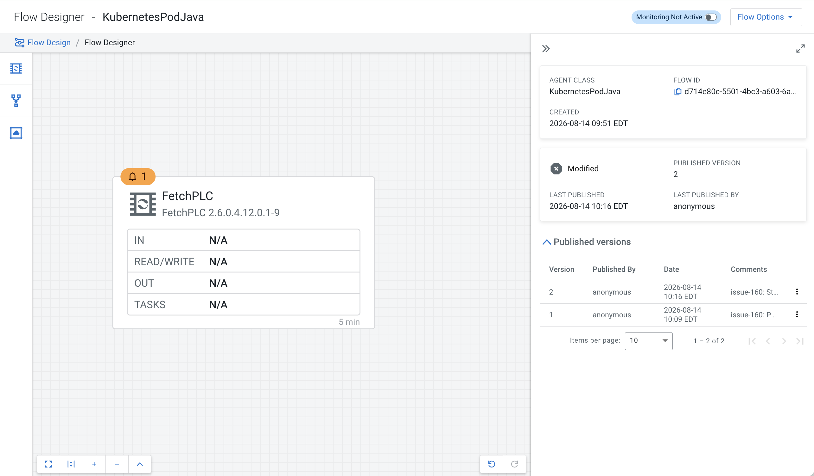
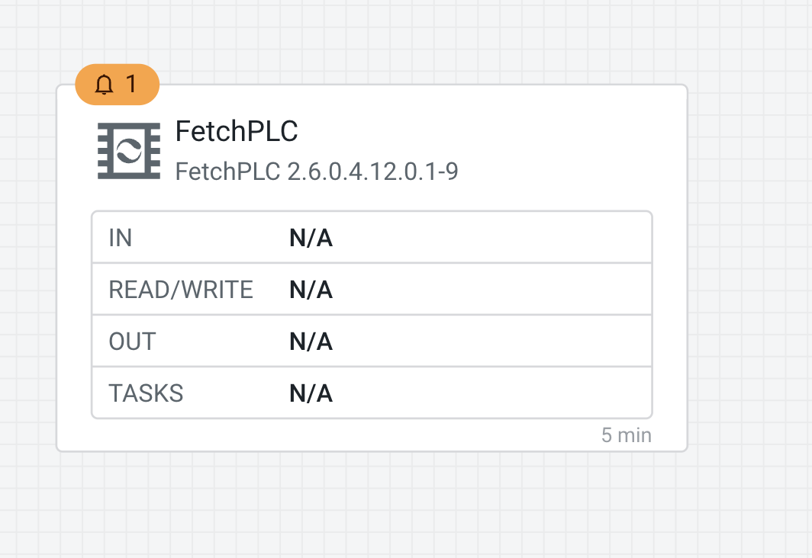
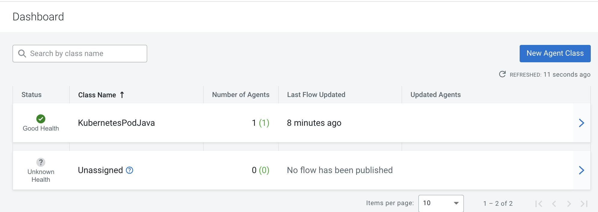

# Issue #160 — PLC4X + IIOT on EFM-managed MiNiFi Java, at CFM 4.12.0

**Question (Marco):** `GhostControllerService` for `com.cloudera.nifi.plc.services.StandardPLC4XConnectionPool`
on a MiNiFi Java agent, and "where is the IIOT nar?"

**Answer:** the PLC4X and IIOT processors are Cloudera-proprietary CDF NARs that ship only inside the
CFM parcel — never in the open-source `-extension` bundle. The "IIOT nar" is `nifi-cdf-iiot-mqtt-nar`.
MiNiFi **C++ cannot load JVM NARs**, so it must be **MiNiFi Java**. The fix is to side-load the NAR
dependency closure into the agent's `extensions/` autoload dir. Once loaded, the controller-service
type resolves and **enables** — the Ghost is gone.

This folder is the full EFM-managed proof, reproduced at Marco's **CFM 4.12.0** versions
(NiFi/CDF build `2.6.0.4.12.0.1-9`).

## What was stood up

| Piece | Value |
|---|---|
| Cluster | minikube profile `iceberg-lab`, ns `cld-streaming` |
| EFM | `efm:2.3.1.0-2`, Postgres backend `efm` DB created in the shared `ssb-postgresql` |
| Agent class / pod | `KubernetesPodJava` / `minifi-agent-plc4x-java` |
| MiNiFi Java framework | `2.24.08.0-19` (CEM 2.4.0) |
| CDF NAR closure | `2.6.0.4.12.0.1-9` (see below) |

## Where the 4.12.0 NARs came from (no parcel download)

Pulled the Cloudera NiFi container image
`container.repository.cloudera.com/cloudera/cfm-nifi-k8s:3.1.0-b129-nifi_2.6.0.4.12.0.1-9`
and re-packed the NARs from its `work/nar/extensions/*.nar-unpacked` dirs — dereferencing the
shared-`nar-lib` symlinks (`cp -RL`), keeping `META-INF/MANIFEST.MF` first, and dropping the
`nar-digest` unpack artifact. The closure, all at `2.6.0.4.12.0.1-9` and dependency-consistent:

- `nifi-cdf-plc4x-api-nar`, `nifi-cdf-plc4x-services-standard-nar`, `nifi-cdf-plc4x-processors-nar`
- `nifi-cdf-iiot-mqtt-nar`
- deps: `nifi-standard-services-api-nar`, `nifi-mqtt-nar`, `nifi-standard-shared-nar`
- (for record-based PLC processors) `nifi-record-serialization-services-nar` — see *Findings*

## Procedure

1. Deploy EFM; create the `efm` DB in `ssb-postgresql`.
2. Stage the MiNiFi Java binary in EFM's agent-deployer PVC (`java/linux` + `java/windows`).
3. Enrol a `KubernetesPodJava` agent via `generateCommand` (server-minted identifier — never hand-built).
4. `kubectl cp` the NAR closure into the agent's `extensions/`; agent manifest goes **0 → 5** `com.cloudera` types.
5. Re-point the class → new `agentManifestId` (`POST /efm/api/agent-class-manifest-config`) so the Designer palette exposes the types.
6. Build a flow with `StandardPLC4XConnectionPool` (+ `FetchPLC`); publish to the agent.

## Result — the palette resolves the CDF type (no Ghost)

`FetchPLC 2.6.0.4.12.0.1-9` dropped onto the EFM Flow Designer canvas for `KubernetesPodJava`
(published version 2). This is the exact type that was Ghosting — now resolved from the manifest.





## Result — agent healthy, flow published

`KubernetesPodJava` reports **Good Health** with **1 (1)** agent and a published flow.



## Result — the controller service enables on the agent

From the agent's `minifi-app.log` (full excerpts in [`proof-log.txt`](proof-log.txt)):

```
DefaultPlcDriverManager Registering driver for Protocol simulated / s7 / opcua / profinet / ...
Enabled StandardControllerServiceNode[service=StandardPLC4XConnectionPool..., name=PLC4X-Pool, active=true]
```
- `GhostControllerService` occurrences: **0**
- EFM `UPDATE configuration` operation: **DONE**
- `StandardPLC4XConnectionPool` persisted in the agent's `conf/flow.json.gz`

## Findings for a full record-reading PLC flow

Resolving the type and enabling the pool is the fix for #160. To go further and actually *read* a PLC
with `FetchPLC`/`ConsumePLC`, two more things are needed (neither is a Ghost/NAR-load problem):

1. **A version-matched record writer.** The stock `JsonRecordSetWriter`
   (`nifi-record-serialization-services-nar:2.24.08.0-19`) is rejected as *"not compatible with
   RecordSetWriterFactory - 2.6.0.4.12.0.1-9"* — the CDF processor links against the `4.12.0.1-9`
   service API. Side-load `nifi-record-serialization-services-nar:2.6.0.4.12.0.1-9` too (exclude
   `META-INF/docs` when re-packing, or `NarUnpacker` throws an IOException on the
   `additional-details/<ClassName>` dirs).
2. **PLC register addresses** for `FetchPLC` as user-defined dynamic properties (`Address Map`).
3. **EFM manifest de-dups controller-service types** — with both the `2.24` and `4.12`
   record-serialization NARs loaded, the Designer only offers `JsonRecordSetWriter` under one bundle,
   so it can't pick the `4.12` writer while the stock `2.24` NAR remains in `lib/`.

## Files here

- [`README.md`](README.md) — this write-up
- [`proof-log.txt`](proof-log.txt) — captured agent/EFM evidence
- [`minifi-plc4x-java.yaml`](minifi-plc4x-java.yaml) — the `KubernetesPodJava` agent pod (deployer command baked in)
- `screenshots/` — EFM Designer + Dashboard captures

> The re-packed CDF NARs are proprietary and are **not** committed here; source them from the CFM
> parcel / the `cfm-nifi-k8s` image as above.
