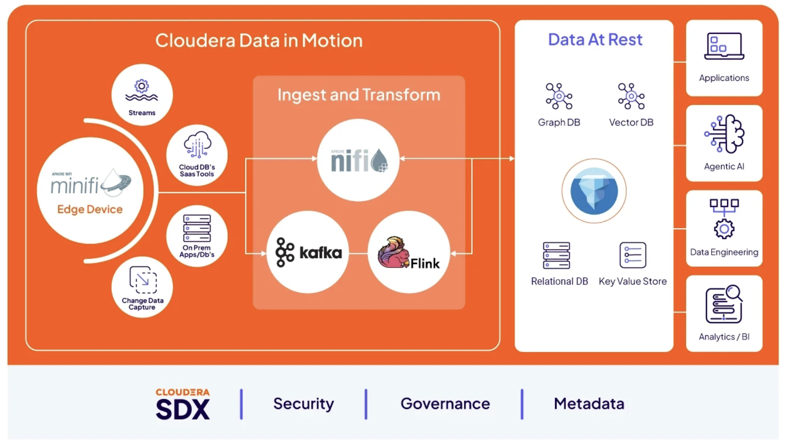

# The Complete Guide to Edge Flow Management

*by Steven Matison*

This is the reader-facing entry point for the guide. Each chapter is built, run, and proven on
real hardware before it lands here — every ✅ points at a source doc I can hand you and a flow I
have actually run. Nothing here is aspirational hand-waving.

Edge Flow Management is the central manager for organizing agent **Classes**, **Resources**, and
**Edge Flows**. NiFi in the datacenter is well documented; EFM is not — until now. What happens out
at the edge — a MiNiFi agent on a Jetson, a Windows box over Tailscale, a Kubernetes pod with no
persistent identity — is where the real problems live: binary delivery, agent enrollment, which
processors actually exist in which build, managing custom processors and resources, and how to get a
flow from a designer canvas onto a device that keeps changing its IP. This guide is the map I wish
I'd had when I first installed [EFM on Kubernetes](https://cldr-steven-matison.github.io/blog/cloudera-edge-flow-manager-on-kubernetes/).

> **Status.** The guide is 19 chapters across 8 parts, plus a real-world demos section. Chapters
> already folded are linked below; the rest are being built and folded under close-plan epic
> [#59](https://github.com/cldr-steven-matison/DesktopShare/issues/59). The per-chapter status of
> record — sources, field-validation notes, and open issues — lives in the tracker,
> [`Complete Guide to Edge Flow Management.md`](../Complete%20Guide%20to%20Edge%20Flow%20Management.md).

---

## Table of Contents

### Part I — EFM Foundations on Kubernetes
Get EFM running and persisted, and fed with agent binaries. The infrastructure everything else rides on.

- **Ch1** — [EFM on Kubernetes (incl. persistence)](ch01-efm-on-kubernetes.md)
- **Ch2** — [EFM Binaries & staging tree](ch02-efm-binaries.md)

### Part II — Processors (C++ & Java)
Which processors actually exist in each build, how `ExecuteScript` availability differs across builds, and how to author custom Python processors as their own types at the edge.

- **Ch3** — [MiNiFi C++ Processor Catalog](ch03-cpp-processor-catalog.md)
- **Ch4** — [MiNiFi Java Processor Catalog](ch04-java-processor-catalog.md)
- **Ch5** — [ExecuteScript Availability](ch05-executescript-availability.md)
- **Ch6** — [MiNiFi custom Python processors](ch06-minifi-custom-python-processors.md)

### Part III — MiNiFi Playground repo
Install and use plain MiNiFi (C++ and Java), then bring EFM in to manage the agents and resources.

- **Ch7** — [Standalone MiNiFi C++ on Kubernetes (no EFM)](ch07-standalone-minifi-cpp-on-k8s.md)
- **Ch8** — [MiNiFi Java setup](ch08-minifi-java-setup.md)
- **Ch9** — [Introduce EFM into the Playground](ch09-efm-in-the-playground.md)

### Part IV — Site-to-Site
The two local k8s transport legs (MiNiFi → NiFi). The three cloud CDP legs (DataFlow, Data Hub) were descoped 2026-08-03. Reference: apache `SITE_TO_SITE.md`.

- **Ch10** — S2S: MiNiFi Java → NiFi K8s *(pending — [#30](https://github.com/cldr-steven-matison/DesktopShare/issues/30))*
- **Ch11** — S2S: MiNiFi C++ → NiFi K8s *(pending — [#30](https://github.com/cldr-steven-matison/DesktopShare/issues/30))*

### Part V — AI at the Edge
The `nifi-and-ai` skill and its EFM machinery as the grounding lead-in, then NiFi + Python, the same idea pushed to a MiNiFi agent, and the StarlinkAI/Lemonade edge-AI router as a worked case study.

- **Ch14** — [The NiFi and AI Skill — EFM Portion](ch14-nifi-and-ai-skill-efm-portion.md)
- **Ch15** — [How to AI with NiFi and Python](ch15-how-to-ai-with-nifi-and-python.md)
- **Ch16** — [How to AI with MiNiFi](ch16-how-to-ai-with-minifi.md)
- **Ch17** — Edge-AI router case study *(pending — [#67](https://github.com/cldr-steven-matison/DesktopShare/issues/67))*

### Part VI — Sample Gallery
Curated, runnable flows accumulated as the guide is built.

- **Ch18** — [Sample gallery of MiNiFi flows](ch18-sample-gallery.md)

### Part VII — Real-World Demos
EFM + NVIDIA Jetson, and the SparkPlug/IIoT demos — the final output and story (NvidiaNano, StarlinkAI, SparkPlug).

- **Ch19** — [EFM + NVIDIA Jetson use case](ch19-efm-and-nvidia-jetson.md)
- **Ch20** — SparkPlug demo *(pending — [#70](https://github.com/cldr-steven-matison/DesktopShare/issues/70))*

### Part VIII — Observability
The layer that watches all of the above — EFM's own metrics, the C++ agent's Prometheus publisher, and the smallest agents' heartbeat metrics, all into one CSO Prometheus/Grafana stack.

- **Ch21** — [Metrics & Observability](ch21-metrics-and-observability.md)

---

## What you have here — and what's still in flight

Read this end to end and you have the map I wish I'd had the first time I tried to run a real flow
at the edge: EFM stood up and persisted on Kubernetes, the actual processor catalogs for the C++ and
Java builds (not the docs' idea of them, the ones I counted on real agents), the four ways
`ExecuteScript` does and doesn't exist, how to author custom Python processors as first-class edge
types, the Site-to-Site legs, the AI-at-the-edge patterns, a gallery of runnable flows, two
real-world demos, and the observability layer that watches all of it. Every ✅ chapter points at a
flow I actually ran on real hardware and a source doc I can hand you.

**This is the published guide** — the chapter files in this directory, read through this index on
GitHub. It lives in the DesktopShare repo; there is no separate document to assemble and no other
site to go to. When you want a chapter's deeper source material or its field-validation trail, follow
the cross-reference at the top of that chapter.

It is not finished, and I won't pretend it is. What's left is folding the remaining chapters into
this directory, field-validating each (or honestly documenting the gap), publishing the two ready
blogs (Ch2, Ch16), and building the first Site-to-Site leg to prove that pattern. That work is
tracked chapter-by-chapter in the
[tracker](../Complete%20Guide%20to%20Edge%20Flow%20Management.md) and coordinated under epic
[#59](https://github.com/cldr-steven-matison/DesktopShare/issues/59). When you hit a chapter that
isn't linked yet, its source doc and current state are in that tracker — the work is in flight, not
imaginary.
