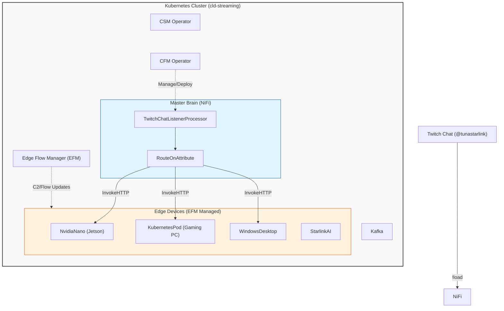

**Status: Single-screen version LIVE and confirmed working end-to-end (2026-07-18).** `!load <streamer>` typed in `tunastarlink`'s real chat now opens that stream full-screen on the Jetson Orin Nano's monitor. Scope was cut way down from the original 5-screen/4-device plan below — see "As-built (2026-07-18)" for what's actually running. The rest of this doc is the original aspirational draft, kept for the multi-screen expansion described at the end.

### As-built (2026-07-18)

Scope: exactly one screen, on the already-registered `NvidiaNano` (Jetson Orin Nano) EFM/MiNiFi agent. Everything else below (multi-device mapping, Windows targets) is deferred until a second screen is actually needed.

**Architecture:** `TunaStreetTest` (Twitch bot account) holds a persistent IRC chat connection *inside NiFi itself* — not a standalone script — as a custom Python processor (`TwitchChatListenerProcessor`, in `nifi-custom-processors`, deployed via the same PVC/`kubectl cp` toolchain as `XLivePostProcessor`). It emits one flowfile per detected `!load <streamer>` command. A brand-new, fully isolated process group (`TwitchChatBot`) inside `mynifi` — no shared connections with `StreamersApp`/`LiveStreamerAlert` — routes it: `TwitchChatListenerProcessor` → `RouteOnAttribute` → `InvokeHTTP` (hardcoded to the Jetson) → `LogAttribute` on failure. The OAuth user token (chat:read+chat:edit, authorized as `@TunaStreetTest`) lives in a NiFi Parameter Context, never a literal processor property.

On the Jetson: a second `ListenHTTP`(`streamChatListener`, port 8081)→`ExecuteScript` pair added onto the *same* MiNiFi canvas as the existing TensorRT flow, without touching it. The script (`files/agent-NvidiaNano-launch_stream.py`) kills any existing Chromium, relaunches it full-screen against the requested streamer's Twitch URL, and force-corrects fullscreen via `wmctrl` since Chromium's own `--kiosk`/`--start-fullscreen` flags don't reliably get Mutter to grant real fullscreen state on this device.

**Bugs hit and fixed, in the order they surfaced:**
1. **`ListenHTTP` buffer/batch size dropped single requests** — the endpoint was copy-configured from the TensorRT listener with `Batch Size: 5`/`Buffer Size: 5`, so a lone test POST just sat there and got silently dropped (`ListenHTTP buffer is NOT full 1/5 ... request was dropped`). The TensorRT endpoint "worked" only because it gets hammered with repeated back-to-back calls. Fix: `Batch Size: 1`/`Buffer Size: 1`.
2. **`XAUTHORITY` was an unfilled placeholder** — the real value, pulled from the live GNOME session's actual process environment, is `/run/user/1000/gdm/Xauthority`, not `/home/<user>/.Xauthority`.
3. **`minifi.service` ran as `root`**, while the GNOME/X11 desktop session belongs to `tunastreet` (uid 1000) — root's environment has no `XDG_RUNTIME_DIR`/D-Bus session address, which snap-confined Chromium needs. Fixed by adding `User=tunastreet` to the systemd unit — which then surfaced a follow-on permissions issue (log/state dirs still owned by `root` from when the service ran as root; fixed with a one-time `chown -R tunastreet:tunastreet` on the MiNiFi install dir).
4. **Chromium launched but wouldn't go full-screen** — `--kiosk`/`--start-fullscreen`/`--window-position=0,0` all got ignored by Mutter. Fix: force it after the fact with `wmctrl -r ' - Twitch - Chromium' -b add,fullscreen`, run as a detached/backgrounded poll (up to 60s, checking every 0.25s) since MiNiFi's `ExecuteScript` runs on a single shared thread and a blocking wait would stall the whole agent.
5. **Chromium's single-instance behavior** proxies a second launch into the existing window and silently ignores all its startup flags unless the prior process is fully dead first — fixed with `pkill -9` (not the default `SIGTERM`) plus a real wait, and a dedicated `--user-data-dir` to remove any profile-lock ambiguity.

**Token refresh (fixed 2026-07-18):** `TwitchChatListenerProcessor` v0.0.2-SNAPSHOT mints a fresh access token from the refresh token before every (re)connect, instead of relying on the one static token that expired every ~4 hours. Twitch rotates the refresh token on every use, so the processor keeps the current one in memory and updates it on each refresh — the seed value stored in the Parameter Context (`twitch-bot-refresh-token`) goes stale after the very first refresh and is never read again for the life of the running processor. Client ID/secret and the refresh-token seed live in the same `twitch-chat-bot-creds` Parameter Context as sensitive params. One real gap: if NiFi/this processor ever restarts, it reseeds from that now-stale stored refresh token and a fresh device-code re-auth would be needed — there's no mechanism yet to persist the rotated refresh token back out to the Parameter Context.

**Chat commands (added 2026-07-18):** `TwitchChatListenerProcessor` v0.0.3-SNAPSHOT responds in chat to `!commands`/`!help` with the available command list — the bot can now post to chat, not just read it (`PRIVMSG #<channel> :<message>` over the same IRC socket).

**Presence announcement + periodic reminder (added 2026-07-18):** v0.0.4-SNAPSHOT announces itself once on join; v0.0.5-SNAPSHOT made that repeat every `Reminder Interval (seconds)` (default 600) since Twitch shows no chat history to viewers who join after the one-time announcement — they'd otherwise never see it or know the bot exists.

**Not yet built:** the multi-screen JSON lookup table, additional device targets, and a Windows launch script — all deferred exactly as scoped below, until a second screen is actually needed. Also considered but not built: swapping the kill/relaunch Chromium cycle for a persistent browser controlled via Chrome DevTools Protocol (`Page.navigate`) for a flash-free URL swap — real win, but needs a hand-rolled websocket client since no websocket library is available in this Python environment; current kill/relaunch (~3-8s, visible flash) works fine for now.

### Second screen — LIVE (2026-07-18): `!load <streamer> screen2` confirmed working end-to-end

`TwitchChatListenerProcessor` v0.0.6-SNAPSHOT parses an optional screen argument (`!load <streamer> [screen1|screen2]`, defaults to `screen1`, no regression on the Jetson path). `TwitchChatBot`'s `RouteOnAttribute` branches on `${screen}` for real (`screen1`→`InvokeNvidiaNano`; `screen2`→`InvokeGamingPC`).

**The GUI-access blocker got solved, not worked around.** `KubernetesPod` (a pod inside minikube, Docker Desktop docker driver) genuinely has zero filesystem/env access to WSLg's GUI sockets — confirmed directly inside the container (no `/tmp/.X11-unix`, no `/mnt/wslg`, no `DISPLAY`). No mount was added (explicitly ruled out). Instead: confirmed the pod **can** reach the Windows host over plain TCP (`host.docker.internal`, the LAN IP, and the Docker Desktop gateway IP all worked), so the pod's `ExecuteScript` doesn't launch a browser itself — it POSTs the Twitch URL to a small native Python HTTP listener (`browser_launcher.py`) running directly on Windows, which owns the actual Chrome launch. Real GUI access problem solved by not needing GUI access inside the pod at all.

**Architecture, confirmed live 2026-07-18:**
- `gaming-pc-launch_stream.py` (pod-side `ExecuteScript`, on `minifi-agent-k8s-gaming`, asset dir) — same `onTrigger`/`session` contract as `agent-NvidiaNano-launch_stream.py`, but POSTs `{"url": "..."}` to `http://host.docker.internal:5901/load` instead of spawning Chromium locally.
- `browser_launcher.py` (native Windows listener, `C:\minifi-manual\`, port 5901, stdlib-only `http.server`) — kills existing Chrome, launches `--kiosk`, and **verifies a real window actually appeared** (`MainWindowTitle` non-empty) before reporting success. Real bug found and fixed here: checking the launched process's own exit code is a false negative — Chrome hands off to an already-running instance via IPC and that specific child process exits 0 regardless of whether a window appeared. Poll for the actual window state instead, same discipline as the Jetson's `wmctrl` check.
- New `ListenHTTP-StreamLoad`(port 8082, `streamChatListener`) → `LaunchGamingPCStream` pair added onto `minifi-agent-k8s-gaming`'s canvas.

**Done properly through EFM's actual API, not left as a local hack.** EFM exposes no OpenAPI spec and its Flow Designer REST schema isn't documented anywhere, so the initial attempt (direct `config.yml` edit + manual `minifi` restart) was corrected by reverse-engineering the real API straight from EFM's own Angular frontend bundle (`main.<hash>.js` — it's an auto-generated OpenAPI client, so every operation name/URL/body-shape is discoverable verbatim in the minified JS, e.g. `FlowDesignerService.createProcessor` → `POST /designer/flows/{flowId}/process-groups/{pgId}/processors` with body `{revision:{version,clientId}, componentConfiguration:{...}}`). Used the proper flow: `GET /designer/client-identifier` → `createProcessor` ×2 → `createConnection` → `validate` → `POST /designer/flows/{id}/publish`. EFM's own C2 heartbeat then pushed the properly-tracked flow down and **replaced** the pod's hand-edited config automatically (new server-assigned processor IDs confirmed present afterward) — no manual restart needed once published correctly. The script itself was also re-registered as a real EFM Resource (`POST /resource-manager/resources/file`, `resourceType=ASSET`) and assigned to the class (`PUT /agent-class-resource-manager/KubernetesPod/save` with `{resourceIdsToBeAssigned, resourceIdsToBeUnassigned}` — the exact field names only found by grepping the frontend bundle for the real assign-dialog's save call), matching the SHA-512 digest of the file already delivered — no content drift. **EFM's UI now correctly shows both new processors and the resource assignment for this class.**

**`browser_launcher.py` persistence — fixed 2026-07-19.** Registered as a Windows Scheduled Task (`BrowserLauncherListener`, `AtLogOn` trigger for `MINI-GAMING-G1\tunas`, `RestartCount=3`/`RestartInterval=1min` on crash, unlimited execution time). Confirmed working by stopping the manually-started process, starting it via `Start-ScheduledTask`, and re-running the full end-to-end test (200 OK, real Chrome window appeared) — the task, not a bare `python.exe` invocation, is now the source of truth for keeping this alive across reboots or crashes.

**Stale `KubernetesPod` agent cleaned up — fixed 2026-07-19.** EFM was showing 2 agents for the class; the second was `minifi-agent-k8s` (no `-gaming` suffix), a leftover from earlier testing whose pod was deleted weeks prior (`MISSING` since 2026-06-24) but never removed from EFM's own agent registry. Confirmed the pod no longer exists (`kubectl get pod` → NotFound), then removed the stale record via `DELETE /efm/api/agents/{id}` (found via the same JS-bundle reverse-engineering as the Flow Designer API — `AgentsService.deleteAgent`). Confirmed via both direct DB query and `cso-operator-app`'s `/api/efm/agent-classes` endpoint: `KubernetesPod` now correctly shows exactly 1 agent.

**Screen2 targeting — first pass fixed 2026-07-19, then found to still be wrong, then actually fixed same day.** First pass: `browser_launcher.py` was launching Chrome with no explicit position, so it landed on the primary monitor by default. Fix at the time: `[System.Windows.Forms.Screen]::AllScreens` confirmed a secondary monitor's bounds (`1280x720` at `(-1920,137)`, `DISPLAY1`, non-primary) and the launch started passing `--window-position=-1920,137 --window-size=1280,720`. This was verified via `GetWindowRect` and looked correct — **but it was pointed at the wrong physical monitor.** Steven confirmed directly (same day, later): on this desktop, Screen1=left=Display1(`DISPLAY1`, the one at `-1920,137`), Screen2=right=Display2(`DISPLAY2`, primary, `0,0`/`1920x1080`) — i.e. the "second screen" the chat command is supposed to target is the **primary** monitor, not the non-primary one `AllScreens` had been aimed at. Real fix: `SCREEN2_POSITION`/`SCREEN2_SIZE` changed to `0,0`/`1920,1080`. Verified via the actual pod→NiFi→listener chain (not just a synthetic curl) and `GetWindowRect` on the resulting window: `L=0 T=0 R=1920 B=1080`, confirmed visually correct by Steven.

Along the way, a real symptom (window ending up on the wrong screen with a black frame briefly appearing on the *intended* screen) was misdiagnosed as a Chrome kiosk-mode bug — the theory being that `--kiosk` locks its rendered output to whichever monitor the cursor is on at launch, and that `MoveWindow` afterward only relocates the window frame, not the actual composited pixels. That's plausible in principle but **wasn't the actual bug here** — the black-frame-then-wrong-monitor symptom was fully explained by the coordinate mistake above (kiosk briefly painting near the cursor's monitor before settling at the — wrong — configured target). A "launch windowed, `MoveWindow`, then trigger fullscreen via a simulated F11 keypress" workaround was built and deployed chasing that theory; it's currently live and does work, but it's unnecessary complexity now that the real bug is fixed — reverting to a plain `--kiosk` launch is on the cleanup list.

**Lesson for next time a "wrong monitor" bug shows up on any device: get the physical left/right layout confirmed directly (Steven's own words: which screen is "screen1" vs "screen2" in his own terms) before trusting `AllScreens`/`GetWindowRect` output at face value — the API can be entirely self-consistent and still be pointed at the wrong monitor if the logical-name mapping is wrong.**

**Both screens were loading the full Twitch page, not just the video — fixed 2026-07-19, took two attempts.** `agent-NvidiaNano-launch_stream.py` and `gaming-pc-launch_stream.py` both built `https://www.twitch.tv/<streamer>` — the real site, sidebar/chat/nav and all, which is what actually loaded fullscreen (kiosk mode hides Chrome's own toolbar, but does nothing about the *page's* own UI).

First attempt: switched both to Twitch's dedicated embed URL, `https://player.twitch.tv/?channel=<streamer>&parent=twitch.tv&muted=false` — no sidebar/chat/page-chrome, just a video element. Deployed and confirmed *reloading* correctly on the gaming PC via `kubectl cp` straight onto the pod's asset path — real finding here: MiNiFi C++'s `ExecuteScript` (Python engine) **re-reads its `Script File` from disk on every trigger**, not once at startup, so the new URL took effect on the very next chat command with zero restart or flow republish needed. But the *content* was wrong: it showed a full-screen "channel is offline, watch their latest video" placeholder for a channel that was actually live. Tried adding a second `parent=player.twitch.tv` (in case the check wants the actual top-level hostname when there's no real embedding iframe) — still offline. The "watch latest video" link Steven found on the placeholder (`.../videos/...?tt_content=embed_watch_latest`) is Twitch's documented embed-rejected fallback UI, confirming this was an embed-parent validation failure, not a real live-status check — but its exact validation logic isn't publicly documented and wasn't worth further guessing against.

**Real fix: dropped `player.twitch.tv` entirely, went back to the real `www.twitch.tv/<streamer>` page (reliably shows the actual live stream), and got Twitch's own player to hide its sidebar/chat/nav via its own fullscreen — same mechanism a viewer gets from clicking the player's expand icon.** Added to `reposition_chrome.ps1` (gaming PC / Windows only, after the existing `MoveWindow` + Chrome-F11 steps): wait ~2.5s for Twitch's SPA to finish rendering the player, click the center of the window (Twitch does not toggle play/pause on a plain click, unlike some other players, so this is safe), then send the `f` key — Twitch's fullscreen hotkey. Confirmed working live: real video, no sidebar, no chat, no browser or page chrome. **Jetson/screen1 script now has the same click+`f` logic — deployed via `xdotool` in `agent-NvidiaNano-launch_stream.py`'s existing `wmctrl` fullscreen-poll step (waits for the window, forces WM fullscreen same as before, then waits 2.5s for Twitch's SPA to render, clicks window-center via `xdotool mousemove`+`click 1`, sends `xdotool key f`).** This is a script-only change — needs shipping to the device the same way as before (EFM UI: unassign → delete → reupload → reassign).

**On-device TODO for Steven, next time at the Jetson:**
- [ ] Confirm `xdotool` is installed (`which xdotool`); if not, `sudo apt install xdotool`. Nothing else in this flow uses it yet, so this is a new dependency.
- [ ] After redeploying the script, test `!load <streamer>` from real chat and confirm: real video loads (not an offline placeholder — shouldn't happen now, we're back on `www.twitch.tv`, not the embed URL), fullscreen, no sidebar/chat/browser chrome.
- [ ] If the click lands somewhere that doesn't focus the player (e.g. chat panel is wider than expected on this screen's resolution and window-center overlaps it), the fix is adjusting the click point in the `fullscreen_poll` string — not a redesign, just a coordinate tweak based on what's actually seen on screen.

Also worth remembering for next time: **EFM has no in-place asset update.** Changing an already-assigned asset's content is unassign → delete from EFM's resource list → re-upload as new → reassign — a same-named re-upload does not overwrite the old resource's stored bytes.

**Listener dying silently, all day — fixed 2026-07-19.** `browser_launcher.py`'s scheduled task only had an `AtLogOn` trigger with no periodic health check. It died sometime the evening of 2026-07-18 (last log line `22:23:48`) and stayed dead until manually restarted the next afternoon — nothing brought it back in between. Two hardening changes made: (1) the task's action now runs `pythonw.exe` instead of `python.exe` under `cmd.exe` — the old setup created a visible console window (this is almost certainly the "black windows cmd" window from earlier debugging), which is a real, plausible way for the process to get killed by an accidental close; `pythonw.exe` has no console window at all. (2) Added a second trigger that repeats every 5 minutes (in addition to the existing `AtLogOn` one) so if it ever dies again, Task Scheduler brings it back within 5 minutes instead of waiting for the next log-on. True root cause of the original death still isn't proven, but the process is no longer a single point of silent, indefinite failure.

**Periodic chat reminder removed — 2026-07-19.** `TwitchChatListenerProcessor` bumped to v0.0.7-SNAPSHOT: the 10-minute repeat of "type !load..." was cut per Steven's direct ask ("axe the repeat messaging for the commands"). The one-time join announcement and on-demand `!commands`/`!help` response both stay — only the unsolicited periodic repost is gone. `Reminder Interval (seconds)` property removed entirely.

**Listener persistence gotcha, worth remembering:** killing the listener with a bare `Stop-Process -Name python` (rather than `Stop-ScheduledTask`) can leave Task Scheduler's own state out of sync with reality (seen once: `Get-ScheduledTask` reported `Ready` while the process was actually dead, and it hadn't auto-restarted via the configured `RestartCount`). Always use `Stop-ScheduledTask -TaskName BrowserLauncherListener` before `Start-ScheduledTask` when redeploying, not a raw process kill.

**Listener has died unexpectedly twice (2026-07-19), root cause NOT yet identified.** Both times the process was simply gone (`Get-Process python` empty) with no external kill command run in between — genuinely unexplained, not the `Stop-Process`-desync gotcha above. Restarting it each time made the pipeline work again, but that's a workaround, not a fix. Added real diagnostics rather than continuing to guess: the script now logs its own start/crash/exit to `C:\minifi-manual\browser_launcher_crash.log` (wrapped in try/except/finally around `serve_forever()`), and the Scheduled Task's action now also redirects raw stdout/stderr to `C:\minifi-manual\listener_stdout.log` as a backstop in case the crash happens below Python's own exception handling. **Next time it dies, check both logs before restarting blind** — this session didn't get a repeat occurrence with logging in place, so the actual cause is still open.

**Other known fragility:**
- `InvokeGamingPC`'s URL is hardcoded to the pod's current IP (`10.244.2.115`) — will break if the pod restarts/reschedules and gets a new IP.
- No kiosk escape hatch wired up (fine for the eventual dedicated-screen deployment; for ad-hoc testing, `Alt+F4` or `Ctrl+Shift+Esc` gets out manually, or `Stop-Process -Name chrome -Force` via the same Windows access used to build this).

**Future feature, not yet built: check the streamer is actually live before shipping the command to a device.** Right now `!load <streamer> [screen]` fires the whole kill/relaunch chain regardless of whether `<streamer>` is live — a typo'd or offline channel still tears down whatever's currently showing. Plan:
- Add a Twitch Helix API check (`GET https://api.twitch.tv/helix/streams?user_login=<streamer>`, needs `Client-Id` header + a token — the existing user OAuth token already used for chat should work fine, Helix's "Get Streams" doesn't need a special scope) into `TwitchChatListenerProcessor` right where it parses `!load`, before it emits a flowfile — the processor already owns the persistent IRC socket used for `!commands`/`!help`, so it's the natural place to both make this check and post the response.
- **If offline (empty `data` array in the response):** don't emit a flowfile at all (nothing gets routed to `InvokeNvidiaNano`/`InvokeGamingPC`), and have `TunaStreetTest` reply in chat, e.g. `"<streamer> is not live right now."`
- **If live:** emit the flowfile as today, and also have `TunaStreetTest` reply confirming it's proceeding, e.g. `"<streamer> is live — loading on screen<N>."` — gives chat immediate feedback instead of silence while the kill/relaunch cycle runs.
- Bump `TwitchChatListenerProcessor` to the next `-SNAPSHOT` version per the existing convention when this lands.

**Related ask, queued 2026-07-22 (Steven's Telegram note, 3:22 PM):** "make the twitch bot respond in chat when it actual kicks off the screen change process." Adjacent to the live-check confirmation above but not necessarily the same thing. The plan above already has the bot reply `"<streamer> is live — loading on screen<N>."` at the moment the live-check passes and the flowfile gets emitted — i.e. when the command is *parsed and accepted* by `TwitchChatListenerProcessor`. Steven's new ask reads as wanting the confirmation tied to the moment the screen-change process is *actually kicked off* on the device — a separate, later step, downstream through `RouteOnAttribute` → `InvokeHTTP` to the target device's `ListenHTTP`/`ExecuteScript`.

Genuine ambiguity, not resolved here: does the existing planned reply above (fired at parse-time, before the HTTP call even goes out) already satisfy this ask, or does Steven want a *second*, later confirmation fired only once the HTTP call to the device actually succeeds? `TwitchChatListenerProcessor` can't see that today — it doesn't get a return signal from `InvokeHTTP`/the device, the flow is fire-and-forget past the processor boundary. If it's the latter, this needs either a callback path back into the processor (new mechanism, not built) or moving the "kicking it off" confirmation into the NiFi flow itself (e.g. `InvokeHTTP`'s success relationship triggering a chat post — but the processor holds the only IRC connection, so this would need some way to reach back into it, or a second lightweight IRC-post mechanism). Confirm which one Steven means before building either. Neither is scoped yet.

### Dispatch-success chat confirmation — built and wired 2026-07-22, blocked on a Twitch scope grant

Steven's answer to the ambiguity above, asked directly: **"Only confirmation single at dispatch."** The already-planned parse-time reply stays as documented (still not built into this feature) — the one confirmation that matters here fires only once the HTTP call to the edge device has actually succeeded.

**Design decision: new processor, Helix REST, not IRC — and deliberately not the listener's user token.** `TwitchChatListenerProcessor`'s IRC socket is private to its own running instance; `InvokeHTTP` has no way to call back into it. Built a second custom Python processor, `TwitchChatReplyProcessor` (`FlowFileTransform`, modeled directly on `XLivePostProcessor`'s structure — Dry Run property, defensive try/except routing every error to `failure`, never crashes). It posts via Twitch's Helix "Send Chat Message" REST API (`POST /helix/chat/messages`) instead of opening a second IRC connection, since a stateless per-flowfile processor has no good place to hold a persistent socket.

The one real design call: **how to authenticate the Helix call.** The obvious option — reuse `TwitchChatListenerProcessor`'s own refresh-token grant (`#{twitch-bot-refresh-token}`) — is a real trap, not just a style preference. Twitch rotates that refresh token on every use (single-use), and the listener already burns it once per (re)connect, keeping the *rotated* token only in its own memory — the seed value sitting in the Parameter Context goes stale the moment the listener first refreshes and is never written back (documented gap, still open). A second processor independently granting off that same seed would either 400 immediately (already stale) or, worse, win a race against the listener and silently invalidate whichever one loses — a real way to break the live IRC bot's reconnect loop while "fixing" something unrelated. Instead, `TwitchChatReplyProcessor` mints a stateless **App Access Token via the Client Credentials grant** (Client ID + Client Secret only — `#{twitch-chat-client-secret}`, same Parameter Context, same Client ID literal as the listener already uses). Client Credentials tokens don't rotate or invalidate anything, so this can't collide with the listener no matter the timing. Broadcaster/sender numeric IDs are resolved once via Helix "Get Users" and cached in memory for the processor's lifetime.

**Wiring.** Confirmed via a live flow dump that all three `InvokeHTTP` processors (`InvokeNvidiaNano`, `InvokeGamingPC`, `InvokeNvidiaNanoMatrix`) auto-terminate their `Original` relationship — the one InvokeHTTP defines specifically as "the request FlowFile, transferred when a 200-299 response was received," carrying the original `streamer`/`screen`/`command` attributes through untouched. (There's also a `Response` relationship, also auto-terminated — that one's for capturing the response body into a new derived FlowFile, not what this needed.) Un-auto-terminated `Original` on all three and connected it to the new processor; NiFi auto-cleared the auto-terminate flag as a side effect of the new connection existing, exactly as observed in a prior session. `TwitchChatReplyProcessor`'s own `failure` relationship routes into the PG's existing `LogInvokeFailure` (reused, no new log processor needed); its `success` is auto-terminated (best-effort confirmation, nothing downstream needs it). Message text is built from the flowfile's `command` attribute: the `!matrix` path gets its own `Matrix Message` property (no `streamer` attribute exists for that path) and the `!load` path uses `Message Template` (EL against `${streamer}`/`${screen}`, default `"${streamer} is now showing on ${screen}."`).

**Deploy.** No build step in this repo — same as `XLivePostProcessor`/`TwitchChatListenerProcessor`, the `.py` is dropped straight onto the PVC-backed extensions mount via `kubectl cp` into the `python-extensions-loader` pod (`/home/ubuntu/extensions/`, same PVC `mynifi-0` mounts at `/opt/nifi/nifi-current/python/extensions`). Registered as `TwitchChatReplyProcessor` `0.0.1-SNAPSHOT`. Created the processor instance and all four connections (3× `Original` in, 1× `failure` out) through the standard NiFi REST API — no full-entity GET-then-PUT anywhere; the only property edit sent after creation was a single-field `autoTerminatedRelationships` PUT on `success` (structural only, zero sensitive properties in that request body). Deployed with `Dry Run: true` first.

**Tested before touching real chat — and correctly didn't.** Built a throwaway, fully isolated test PG (`TwitchChatReplyTest`, own `GenerateFlowFile` → `UpdateAttribute` → a second `TwitchChatReplyProcessor` instance with `Dry Run: false` and a message clearly prefixed `[claude test] ... please ignore` → `LogAttribute`), bound to the same `twitch-chat-bot-creds` Parameter Context, run once, then deleted — zero contact with the live `TwitchChatBot` PG's actual queue. Result: the mechanism works exactly as designed (App Access Token minted fine, user lookups resolved fine, real POST reached Twitch) but Twitch rejected it with a clean, specific error:

```
HTTP 401: {"error":"Unauthorized","status":401,"message":"The sender must have authorized the app with the user:write:chat and user:bot scopes."}
```

No chat message was ever sent — the 401 happens before Twitch queues anything. Test PG torn down immediately after.

**Re-authorized — 2026-07-22, same session.** Ran Twitch's OAuth device-code grant flow (`POST https://id.twitch.tv/oauth2/device` with the app's Client ID — non-sensitive, `r6tml86sg6hp478lj9zr0xfoj41631` — and the full needed scope list `chat:read chat:edit user:write:chat user:bot`), Steven approved it in a browser as `@TunaStreetTest` at the resulting `twitch.tv/activate` URL, polled `POST .../oauth2/token` until granted. Confirmed via the token response: `scope: ['chat:edit', 'chat:read', 'user:bot', 'user:write:chat']` — all 4 present, the two missing ones now granted. This is a server-side authorization record on Twitch's side (which scopes `@TunaStreetTest` has granted this Client ID) — independent of which specific token anyone holds, so `TwitchChatReplyProcessor`'s own App Access Token (minted fresh per-call via Client Credentials) is now covered without needing any credential swap.

**Deliberately not done in this pass**: didn't write the new device-flow refresh token into the `twitch-bot-refresh-token` parameter — NiFi blocked it anyway (`409`, "referenced by PythonProcessor[TwitchChatListenerProcessor]... which is currently running"), and it wasn't actually needed for this fix (`TwitchChatReplyProcessor` never reads that parameter). Doing it would mean briefly stopping the live IRC listener, which wasn't asked for — left alone. Worth revisiting separately: that fresh token could refresh the listener's stale reconnect-seed gap (documented above, "Token refresh" section) the next time a deliberate bot restart happens anyway.

**✓ LIVE — `Dry Run` flipped to `false` (2026-07-22, same session).** Stop → property-only PUT (`Dry Run: true → false`, no sensitive properties touched) → restart, confirmed `RUNNING` with `Dry Run: false` via the NiFi API.

**Bug found on the first real test, same session: message was just the bare streamer name (`"jynxzi"`), not the templated `"jynxzi is now showing on screen1."`** Confirmed via NiFi provenance on the real event — `streamer`/`screen` attributes were correctly present on the flowfile (`streamer='jynxzi'`, `screen='screen1'`), and the live `Message Template` property was correctly `${streamer} is now showing on ${screen}.` — so it wasn't a wiring or config problem. **Root cause: this NiFi Python processor binding's `PropertyValue.evaluateAttributeExpressions(flowfile).getValue()` only resolves the first `${attr}` token in a property and silently drops any literal text and additional tokens around it.** No other custom Python processor in this repo exercises mixed literal-text-plus-multiple-tokens EL (`XLivePostProcessor`'s equivalent call is against a single bare `${tweet_text}`-style reference, built upstream by a Java `ReplaceText` processor instead) — this is the first time that path got tested, and it doesn't work as NiFi's Java-side EL normally would.

**Fixed (v0.0.2-SNAPSHOT):** replaced the `evaluateAttributeExpressions()` call with manual `re.sub(r'\$\{(\w+)\}', ...)` substitution against `flowfile.getAttributes()` directly — same `${name}` property syntax, no property values needed to change. Verified standalone against the real failing case plus edge cases (missing attribute → empty substitution, not a crash) before touching production. Deployed via `kubectl cp` onto the `custom-python-extensions` PVC; NiFi detected the new bundle (`multipleVersionsAvailable: true`) but the running instance stayed pinned to `0.0.1-SNAPSHOT` until explicitly switched — stop → `PUT` with `component.bundle.version: "0.0.2-SNAPSHOT"` → restart, confirmed `RUNNING`/`VALID` on the new bundle with all properties (including `Dry Run: false`) intact across the switch. **General lesson for `how-to-nifi-and-ai.md`: dropping a new `.py` version onto the PVC alone is not enough — a running Python processor instance needs an explicit bundle-version switch (stop → PUT `component.bundle.version` → start) to actually pick it up, unlike MiNiFi C++'s `ExecuteScript`, which re-reads its script file on every trigger with no restart needed.**

**Not yet re-verified against a real dispatch since the fix** — needs another real `!load`/`!matrix` to confirm the fixed template renders correctly in actual chat.

### `!matrix` command + watchlist-on-join — LIVE (2026-07-21)

Two more chat commands added, both confirmed working live end-to-end.

**`!matrix`** turns on the Jetson's existing matrix-rain screensaver (built separately, documented in `claude-screen.md` — a systemd idle-watcher that already knows how to kill/relaunch Chromium in kiosk mode against `~/matrix-screensaver.html` and force real fullscreen with `wmctrl`, driven off `xprintidle`). This just gives that same effect a manual, on-demand trigger from chat, wired the same way as `!load`:

`TwitchChatListenerProcessor` (bumped through `0.0.8` → `0.0.11-SNAPSHOT`) now also matches a `Matrix Command` property (default `!matrix`), acks in chat ("Loading the matrix screensaver..."), and emits a flowfile with `screen=matrix` — reusing the exact same routing attribute `!load` already sets, so `RouteOnAttribute` just got a third branch (`"matrix": "${screen:equals('matrix')}"`) alongside `screen1`/`screen2`, wired to a new `InvokeNvidiaNanoMatrix` → the Jetson's new `ListenHTTP` (`matrixListener`, port 8082) → `ExecuteScript` (`agent-NvidiaNano-launch_matrix.py`) → the existing `PublishKafka` (topic `agent-nvidia-streamChat`, reused rather than standing up a new topic). Deployed to the Nano through EFM's real Flow Designer + Resource Manager API (see `reference-efm-flow-designer-api` memory) — resource uploaded, assigned to the `NvidiaNano` class, flow validated and published (v15/v16).

**Bug hit and fixed:** first version of `agent-NvidiaNano-launch_matrix.py` matched the Chromium window for the `wmctrl` fullscreen-force step by WM_CLASS (`wmctrl -lx`, grepping for `chromium.chromium`) instead of window title, since the matrix HTML's `<title>` wasn't known ahead of time. Confirmed live: the command worked end-to-end (page loaded, killed/relaunched correctly) but the window **stayed windowed** — the real WM_CLASS string (something like `chromium-browser.Chromium-browser`) doesn't contain the literal substring `chromium.chromium`, so the poll loop silently never found a match and timed out after 60s with no fullscreen ever applied. Real fix: match on window *title* instead, same mechanism `agent-NvidiaNano-launch_stream.py` already uses successfully — Chromium always appends `" - Chromium"` to the title bar regardless of what page is loaded, so `wmctrl -l | grep -qi -- ' - Chromium'` finds the window without needing to know the matrix page's own title, then `wmctrl -r 'Chromium' -b add,fullscreen` (substring match) forces it. Redeployed through EFM's unassign → delete → re-upload → reassign asset-update cycle (no in-place update exists), republished as flow v16. Confirmed fullscreen after the fix.

**Watchlist-on-join:** the bot's join announcement now also posts the currently-active streamer watchlist (`GET http://cso-operator-app.default.svc.cluster.local:8090/api/streamers/watchlist`, reachable in-cluster from the `mynifi-0` pod even though it's a different namespace/LoadBalancer service — no new networking needed). Two corrections made live after the first version posted:
- The roster/watchlist is cross-platform (Twitch + Kick, `kick:`-prefixed logins) but this bot only ever lives in Twitch chat — Kick entries are filtered out before posting.
- First pass formatted each name as `@login`; dropped that — Twitch chat doesn't turn `@name` into a link to the streamer's page or anything else useful here, so it's just plain names now.

Both features required no changes to `Client Secret`/`Refresh Token` — every processor edit only ever sent the two new/changed properties in the PUT body, never a full round-trip of the existing config, so the parameter-context-backed secrets were never at risk of the `"********"` mask-corruption bug (see `reference-nifi-api-access` memory).

---

## Future Plan: Bot Joins Streamer Channels (queued 2026-07-22, plan only — not scoped for implementation)

Steven's Telegram note, 11:39 AM: "Can we Make the twitch bot join the streamer channel? - then we want to allow the bot to kick off process in their channel - need to be strategic and rate limited - for example add to watch list, post a clip, send online notice, recognize offline / remove watchlist."

Per Steven's own framing ("can be a plan not action") — this is design only. Nothing below has been built, and it isn't scoped for a build session yet.

**What changes.** Today `TwitchChatListenerProcessor` holds exactly one persistent IRC connection, into `tunastarlink`'s own channel (Steven's channel) — it listens for and responds to commands only there. This ask is for the bot to also join arbitrary streamer channels (drawn from the watchlist/roster) and both listen and act *in their chat*, not just Steven's.

**The four trigger actions Steven listed, and what they'd hook into:**
- **Add to watchlist** — existing capability. `POST /api/streamers/watchlist/add` (`services/streamers.py`), the same endpoint `LiveStreamerAlert`'s `AddToWatchlist` branch and `agent-watchList.sh add` already use — see the API table in `cso-operator-app-streamers.md`. No new backend needed for this piece.
- **Post a clip** — existing capability. `POST /api/streamers/publish` or `/api/streamers/publish-next` — see the same API table. No new backend needed.
- **Send an online notice** — this is functionally what `LiveStreamerAlert` already does, roster-wide (see the "LiveStreamerAlert" section in `cso-operator-app-streamers.md`) — but it posts to X, not into the streamer's own Twitch chat. Whether "online notice" here means that existing X post, or a *new* notice posted directly into the streamer's own chat via this bot, isn't specified — different mechanism, needs Steven's call.
- **Recognize offline / remove from watchlist** — `LiveStreamerAlert`'s live/offline detection (`RouteIsLive`, `GetTwitchLiveStatus`/`GetKickLiveStatus`) is already roster-wide and runs independently of this bot. No `remove-from-watchlist` endpoint exists yet, though — only additive/rotate/full-replace (`watchlist/add`, `watchlist/rotate`, `POST /watchlist`) per the existing API table; a scoped removal endpoint would be new.

**"Strategic and rate limited" — open design questions, deliberately not decided here:**
- How many channels can the bot realistically join and stay connected to at once? A bot that's only ever moderated one channel (its own) has different Twitch IRC rate-limit headroom than a bot joining many third-party channels simultaneously — untested.
- What triggers a join — only currently-live roster members (join on detected-live, part on offline)? On watchlist-add? Something else? Unspecified.
- What does "rate limited" actually bound — per-channel message rate (how often the bot can speak in any one chat), a global cap on how many channels get automated actions per period, or both? Unspecified.
- **Moderator status matters and isn't addressed yet.** In `tunastarlink`'s own channel the bot can presumably be modded by Steven directly. In a third-party streamer's channel it won't be a mod by default — Twitch's chat rate limits are meaningfully tighter for non-mod bots (message-per-30s caps, etc.) than for mods, which changes what's even safe to attempt in someone else's channel without their explicit buy-in. Doesn't affect read-only listening, but affects "post a clip"/"send an online notice" if those mean posting *into that streamer's own chat*.

**Not scoped for implementation.** No architecture, no code, no NiFi flow changes proposed here beyond the existing capabilities already listed above — this section exists so a future session has the requirements and open questions written down, not a build plan.

---

**Full Detailed Implementation Plan (original draft — superseded by the as-built section above for the single-screen MVP)**  
**Project: Chat-Controlled Multi-Monitor Stream Loader (Twitch + Edge Automation)**

**Version:** 1.0  
**Date:** July 18, 2026  
**Goal:** Allow viewers in your Twitch chat to type simple commands that dynamically open Chromium browsers showing specific streams on designated physical monitors/screens across multiple devices. Use one bot account and leverage your existing MiNiFi / Edge Flow Manager infrastructure.

### 1. Project Overview & Objectives

**Primary Goal**  
Enable chat-driven control of 4–5 physical screens/monitors by launching Chromium browsers with stream URLs.

**Scope (Current Phase)**  
- Twitch bot account (`@TunaStreetTest`)
- Load streams using Chromium browser
- Distributed execution using MiNiFi agents on edge devices
- Central routing and mapping handled in NiFi

**Success Criteria**  
- Bot joins chat when your main channel goes live  
- Command `!load xqc screen3` reliably opens the correct stream on the correct monitor  
- System works across mixed Windows + Linux devices  
- Easy to manage and extend via Edge Flow Manager

### 2. High-Level Architecture

```
Twitch Chat (@tunastarlink)
        ↓
Twitch Bot (@TunaStreetTest)          ← Lightweight Python bot
        ↓ (HTTP POST)
Central NiFi Instance (Master Brain)  ← Runs on main PC
        ↓ (Lookup + Route)
Edge MiNiFi Agents (per device)
        ↓ ListenHTTP
        ↓ ExecuteScript (Python)
Chromium Browser on correct monitor
```

**Key Components**
- **Twitch Bot**: Handles chat connection, live detection, command parsing, and forwarding to Central NiFi.
- **Central NiFi**: Acts as the intelligent router. Contains the screen-to-device mapping and decides which edge agent to call.
- **Edge MiNiFi Agents**: Lightweight agents on each physical device. Receive triggers via HTTP and execute local Python scripts to launch Chromium on the correct monitor.
- **Mapping Layer**: Central lookup table that translates logical screen names (screen1, screen2, …) into specific devices + monitor indices.

### 3. Command Format

**Recommended Starting Format**
```
!load <streamer> <screen>
```

**Examples**
- `!load xqc screen2`
- `!load ninja screen4`
- `!clear screen3`

**Future Possible Extensions**
- `!load xqc screen2 volume=50`
- `!swap screen1 screen2`

### 4. Screen-to-Device Mapping

Create a central mapping (stored as JSON in NiFi or a file):

```json
{
  "screen1": {
    "device": "windows-main",
    "os": "windows",
    "monitor_index": 1,
    "agent_url": "http://192.168.1.50:8080/streamChatListener"
  },
  "screen2": {
    "device": "windows-main",
    "os": "windows",
    "monitor_index": 2,
    "agent_url": "http://192.168.1.50:8080/streamChatListener"
  },
  "screen3": {
    "device": "jetson-nano-01",
    "os": "linux",
    "monitor_index": 1,
    "agent_url": "http://192.168.1.101:8080/streamChatListener"
  },
  "screen4": {
    "device": "linux-box-02",
    "os": "linux",
    "monitor_index": 2,
    "agent_url": "http://192.168.1.102:8080/streamChatListener"
  },
  "screen5": {
    "device": "windows-laptop",
    "os": "windows",
    "monitor_index": 3,
    "agent_url": "http://192.168.1.60:8080/streamChatListener"
  }
}
```

This mapping lives in Central NiFi and is easy to update.

### 5. Detailed Component Specifications

#### 5.1 Twitch Bot (@TunaStreetTest)
- **Language**: Python (recommended: `twitchio` library) (code already working in streamers app)
- **Responsibilities**:
  - Check every 30–60 seconds if main channel is live (Twitch Helix API)
  - When live → connect to chat and send intro message
  - Listen for messages starting with `!load` or `!clear`
  - Parse command → extract streamer name + target screen
  - Send HTTP POST to Central NiFi with payload:
    ```json
    {
      "command": "load",
      "streamer": "xqc",
      "screen": "screen3",
      "timestamp": "..."
    }
    ```
- **Auth**: Use OAuth token with `chat:read` + `chat:edit` scopes
- **Hosting**: Runs on main PC 

#### 5.2 Central NiFi (Master Brain)
- **Role**: Routing, mapping lookup, logging, error handling
- **Key Processors**:
  - `HandleHttpRequest` or `ListenHTTP` (to receive from Twitch bot)
  - `EvaluateJsonPath` or `UpdateAttribute` for parsing
  - Lookup table (JSON file or attributes) for screen mapping
  - `InvokeHTTP` to forward to the correct edge MiNiFi agent
- **Benefits**: Visual flows, easy to modify routing logic, central logging

#### 5.3 Edge MiNiFi Agents
- One agent per physical device
- Use `ListenHTTP` processor to receive triggers from Central NiFi
- `ExecuteScript` processor (Python) to run the browser launch logic
- need alternative for python on windows - will do linux only for now.
- Pass parameters: `streamer`, `screen`, `monitor_index`, `os`

### 6. Browser Launch Logic (Device-Specific)

Each edge device will have its own Python script logic:

**Linux (Jetson Nano, etc.)**
```python
import subprocess
import os

def open_stream(streamer, monitor_index):
    display = f":0.{monitor_index - 1}" if monitor_index > 1 else ":0.0"
    url = f"https://www.twitch.tv/{streamer}"
    env = os.environ.copy()
    env["DISPLAY"] = display
    subprocess.Popen(["chromium-browser", "--new-window", url], env=env)
```

**Windows**
- Use Chrome command line with window positioning or libraries like `pyautogui` + `pywin32`
- Or launch Chrome then move/resize the window to the correct monitor

You will maintain separate Python scripts (or conditional logic) per OS inside the MiNiFi `ExecuteScript` processor.

### 7. Implementation Phases

**Phase 1: Foundation (Twitch Bot + Basic Forwarding)**
- Create and authorize `@TunaStreetTest` bot account
- Build basic Python bot that detects live status and joins chat
- Implement command parsing for `!load`
- Make bot send simple HTTP POST to a test endpoint (your main PC)

**Phase 2: Central NiFi Brain**
- Set up Central NiFi instance
- Create flow that receives HTTP from Twitch bot
- Implement screen-to-device mapping lookup
- Forward to a test `ListenHTTP` endpoint

**Phase 3: Edge MiNiFi + Browser Launch**
- Install/configure MiNiFi agents on all devices via Edge Flow Manager
- Create `ListenHTTP` → `ExecuteScript` flow on each agent
- Write and test Python browser launch scripts (Linux + Windows versions)
- Test end-to-end on one screen

**Phase 4: Full Integration & Polish**
- Deploy full mapping to Central NiFi
- Add intro message when bot joins chat
- Add basic error handling and logging
- Test across all 4–5 screens
- Document the mapping table

### 8. Tools & Technologies

- **Twitch Bot**: Python + twitchio (or tmi.js)
- **Central Brain**: Apache NiFi
- **Edge Agents**: Apache MiNiFi (Java or C++ agent) + Edge Flow Manager
- **Browser Control**: Chromium + Python `subprocess` / automation libraries
- **Communication**: HTTP (POST) between all components
- **Configuration**: JSON mapping file

### 9. Security & Best Practices

- Use internal network IPs only (no public exposure)
- Add simple token-based auth on `ListenHTTP` endpoints if desired
- Rate-limit commands in the Twitch bot
- Log all commands with timestamps
- Keep the bot account as a regular moderator (not broadcaster)
- Test thoroughly in a test channel first

### 10. Risks & Mitigations

| Risk                        | Mitigation                              |
|----------------------------|-----------------------------------------|
| Bot gets rate-limited      | Add delays and respect Twitch limits    |
| Browser windows pile up    | Add `!clear` command + periodic cleanup |
| Mapping becomes outdated   | Store mapping in version-controlled file|
| Device goes offline        | Add retry logic + status reporting in NiFi |
| Windows vs Linux differences | Maintain separate scripts per OS     |


### 12. Next Actions (Recommended Order)

1. Finalize the exact command syntax you want.
2. Create the `@TunaStreetTest` bot account and get it modded.
3. Build the basic Twitch bot that can parse commands and send HTTP (Phase 1).
4. Set up Central NiFi flow with mapping lookup.
5. Deploy MiNiFi agents and test browser launch scripts on each device type.
6. Connect everything end-to-end.

---

### Architecture Diagram with Gemini


Here is the architectural diagram for your current setup. This maps the control flow from your Twitch bot through the Kubernetes-based brain to your edge devices.



### Architectural Notes

* **The Brain (NiFi):** The `TwitchChatListenerProcessor` acts as your entry point, parsing chat commands into NiFi FlowFiles. The `RouteOnAttribute` processor logic determines which physical agent receives the instruction.
* **Control Plane (EFM):** While NiFi handles the real-time *trigger* via HTTP, EFM remains the source of truth for the *code* running on those devices. Your flow deployments (via the API reverse-engineering you performed) ensure the local Python scripts (`agent-NvidiaNano-launch_stream.py`, etc.) are consistently synchronized.
* **Infrastructure:** The CSM and CFM Operators facilitate the lifecycle of the services inside your `cld-streaming` namespace, keeping your Kafka, NiFi, and EFM instances resilient.
* **Execution:** The HTTP POST from NiFi directly hits the `ListenHTTP` endpoint on each edge device, bypassing the EFM control plane for execution speed, which is exactly how you want it for low-latency browser launching.

___ 