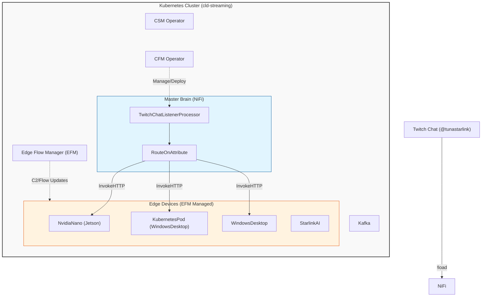

# Twitch Chat Bot — Multi-Screen Stream Loader + Chat Automation

**Status (2026-07-24):** Live and confirmed working end-to-end: screen1 (NvidiaNano/Jetson), screen2 (WindowsDesktop via `KubernetesPod`), `!matrix` screensaver trigger, `!commands`/`!help`, on-demand `!watchlist`, join announcement (no longer auto-posts the watchlist — see section 3), dispatch-success chat confirmation, and — new this session — the watchlist channel-join bot (section 13). All built entirely inside existing infra — no standalone bot process, everything runs as NiFi/MiNiFi processors managed through the normal deployment paths (API, EFM Flow Designer/Resource Manager). See the `TODO / To Review` section at the bottom for what's still open.

---

## 1. Project Overview & Objectives

**Goal:** Let viewers in Twitch chat trigger physical actions — loading a stream full-screen on a specific monitor across the array's devices — using one bot account (`@TunaStreetTest`) and the existing MiNiFi/EFM infrastructure.

**Achieved scope:** 2 screens (NvidiaNano, WindowsDesktop), plus a bonus `!matrix` screensaver trigger and chat-automation features (commands, announcements, dispatch confirmations) beyond the original stream-loading goal. The original 4-5 screen/mixed-Windows-fleet vision is deferred, not abandoned — see TODO.

## 2. High-Level Architecture

```
Twitch Chat (target streamer's channel)
        ↓
TwitchChatListenerProcessor (custom NiFi Python processor, persistent IRC socket)
        ↓
TwitchChatBot process group (mynifi, isolated from StreamersApp/LiveStreamerAlert)
  RouteOnAttribute → InvokeHTTP (per device)
        ↓
Edge MiNiFi agents (EFM-managed): NvidiaNano, KubernetesPod (WindowsDesktop)
  ListenHTTP → ExecuteScript → Chromium (kiosk, forced fullscreen)
```

See the mermaid diagram at the bottom for the full real topology (Kafka, EFM, operators included).

**Key components as actually built:**
- **Twitch listener**: not a standalone script — `TwitchChatListenerProcessor`, a custom NiFi Python processor (`nifi-custom-processors`) using NiFi's `FlowFileSource` base class, holding a persistent IRC socket in a background thread.
- **Central NiFi**: the `TwitchChatBot` process group inside `mynifi` — fully isolated, no shared connections with `StreamersApp`/`LiveStreamerAlert`.
- **Edge devices**: `ListenHTTP`→`ExecuteScript` pairs on each MiNiFi agent, deployed/updated through EFM's real Flow Designer + Resource Manager API (see `reference-efm-flow-designer-api` memory and `references/minifi-efm.md` in the `nifi-and-ai` skill).

## 3. Command Format (as built)

- `!load <streamer> [screen1|screen2]` — defaults to `screen1`.
- `!matrix <screen1|screen2|screen3|screen4>` — triggers the matrix-rain screensaver on the named screen (`screen1` = Jetson). **Updated 2026-07-25: screen argument is now required, no bare `!matrix` default** — see `claude-screen.md`'s "Chat command syntax" note for the current, authoritative behavior and the full 4-screen mapping (this doc predates screens 3/4 and the mpv-based rebuild — treat `claude-screen.md`/`streamers-twitch-bot-mpv-plan.md` as current, this section as historical).
- `!watchlist` — posts the active streamer watchlist on demand, **all entries including Kick (`kick:`-prefixed) as of 2026-07-26** — the earlier Twitch-only filter was dropped now that `kick:`-prefixed logins work correctly end to end elsewhere in the pipeline; the reply now matches the app's own watch-list view exactly instead of silently being a Twitch-only subset. Added in `TwitchChatListenerProcessor` `0.0.13-SNAPSHOT`, replacing the old auto-post-on-join behavior — reconnects happen often enough that repeating the full list every time read as spam, so join now just mentions `!watchlist` is available instead of dumping the list itself. Same message either way (`_format_watchlist_message()`), just on-demand instead of automatic.
- `!chat <streamer|off|me>` (short form `!c <streamer|off|me>`, like `!l`/`!m`/`!w`) — **broadcaster/moderator only** — re-points @tunastarlink's left-side overlay chat column at another channel's chat (raids/collabs); `off`/`me` return it to @tunastarlink's own chat. A target may be a Twitch login **or** a Kick channel as `k:<slug>`/`kick:<slug>` (Kick relay live, #306). A non-mod is ignored silently. **A bare `!c` (no argument) is short for `!commands`.** Added in `0.0.29-SNAPSHOT` (#300); the `!c overlay` longhand was dropped and `!c` made the short form in `0.0.30-SNAPSHOT` (2026-09-07). Emits an `overlay_relay` FlowFile → `RouteChatAction`'s `overlay_relay` route → `InvokeOverlayRelay` (`POST /api/overlay/relay`) in the `ChatTriggers` PG. The relay itself (one anon Twitch IRC socket **or** Kick Pusher WS per target, → Kafka `overlay_chat_relay` + SSE) lives in `cso-operator-app` (`services/overlay_relay.py`), not NiFi. Silent swap — no chat ack. Golden-source spec: `twitch-overlay-chat-relay-plan.md`.
- `!commands` / `!help` — bot replies in chat with the available command list (now includes `!watchlist` and `!chat`).

## 4. Screen-to-Device Mapping (as built)

| Logical target | Device (EFM agent class) | Mechanism |
|---|---|---|
| `screen1` | `NvidiaNano` (Jetson Orin Nano) | `ListenHTTP` (`streamChatListener`, :8081) → `ExecuteScript` (`agent-NvidiaNano-launch_stream.py`) → POSTs to `mpv_stream_launcher_linux.py` (`127.0.0.1:5902`), a native host listener that owns the real mpv playback. **Migrated off Chromium 2026-08-02** — the script no longer builds a URL, which is what fixed `!load kick:<slug> screen1`; see `streamers-twitch-bot-mpv-plan.md`. |
| `screen2` | `WindowsDesktop` MiNiFi **Java** agent (native, not the pod — as found live 2026-09-07, #307) | `HandleHttpRequest` (:8082 on the host) → `ExecuteStreamCommand` `files/windows_screen_control.py mpv-load screen2` → mpv. **The agent must run in the interactive session (Session 1).** Started from the services session (Session 0, as the 2026-08-29 instance did) every `s2` launches mpv onto a desktop with no screen — HTTP 200, log line, nothing visible. Recovery (elevated — these are Services-session processes): kill **both** Session-0 javas — MiNiFi is a bootstrap + child pair and the bootstrap respawns the child within a second if it's killed alone (seen 2026-09-07) — **and** any Session-0 `mpv.exe`, then start the `WindowsDesktop-MiNiFi-AutoStart` task (logon-triggered → Session 1), confirm `java` has `SessionId 1` and owns `:8082` (`Get-NetTCPConnection -LocalPort 8082`). Skip the Session-0 mpv and the next `s2` opens a visible mpv with **no stream**: the leftover owns `\\.\pipe\mpv-screen2` and the launcher logs `[Errno 13] Permission denied: '\\.\pipe\mpv-screen2'` on the `loadfile` (`C:\minifi-manual\windows_screen_control.log`). `_reap_windowless_mpv` can't kill a Session-0 mpv from the user session, so it does not cover this. `windows_screen_control.py` (68bd1e2) and `starlinkai_screen_control.py` (#308) also reap a windowless mpv holding the pipe, as defense-in-depth — that guard cannot fix a Session-0 launch by itself. **Check the java SessionId after every reboot.** The earlier `KubernetesPod`→`browser_launcher.py` `:5901` Chrome path and the `mpv_stream_launcher.py` `:5902` listener are vestigial, not the live dispatch. |
| `matrix-screen1` | `NvidiaNano` | second `ListenHTTP` (`matrixListener`, :8082) → `ExecuteScript` (`agent-NvidiaNano-launch_matrix.py`) |

Routing is `RouteOnAttribute` inside `TwitchChatBot`, branching on `${screen}` (`screen1`/`screen2`/`matrix-screen1`, plus `matrix-screen2`/`3`/`4` added later — see `claude-screen.md`) — `InvokeNvidiaNano`, `InvokeGamingPC`, `InvokeNvidiaNanoMatrix`. (Renamed from bare `matrix` to `matrix-screen1` on 2026-07-25 to unify with the other screens' explicit numbering — same endpoint, only the internal routing name changed.)

**Known fragility:** `InvokeGamingPC`'s URL is hardcoded to the pod's current IP — breaks on pod reschedule.

## 5. Component Specifications (as built)

**5.1 Twitch chat listener** — `TwitchChatListenerProcessor` (`0.0.22-SNAPSHOT`, `RUNNING`/`VALID` as of 2026-08-21). Auth is a user OAuth token (scopes `chat:read chat:edit user:write:chat user:bot`) via Twitch's device-code grant. **Both sensitive properties are Parameter Context references, and have been since the 2026-07-25 migration** — `Client Secret` → `#{twitch-chat-client-secret}` and `Refresh Token` → `#{twitch-bot-refresh-token}`, both in the `twitch-chat-bot-creds` context. Confirmed live 2026-08-21 via `GET /parameter-contexts/{id}` → `referencingComponents`, which lists `TwitchChatListener` against both. **Do not re-derive this from `flow.json.gz`:** NiFi stores the *resolved* value of a parameter reference as `enc{...}`, identical in form to a real literal, and a `GET /processors/{id}` masks either as `"********"` — reading `enc{}` as "still a literal" is what produced a false "the migration regressed" claim on 2026-08-21 (issue #199). `referencingComponents` is the only authoritative check; see `nifi-and-ai` `SKILL.md` rule 1's carve-out. The GET-then-PUT rule still applies regardless — a full-entity round-trip is what destroyed these credentials twice in one day before the migration. Mints a fresh access token before every (re)connect. **Twitch does *not* rotate the refresh token for this app** — measured 2026-08-21 (#202): the value returned by the refresh grant is byte-identical to the device-code seed, on both this app and the watchlist bot's. Since `0.0.23-SNAPSHOT` the returned token is persisted to NiFi component state (`Scope.LOCAL`, key `refresh_token`) and read back ahead of the property, so the property is now a seed; that is defence in case Twitch ever does rotate (its docs say the token *may* change, and public clients do), not a fix for an observed rotation. Also posts to chat (`PRIVMSG`): command replies, a one-time join announcement (mentions `!load`/`!matrix`/`!watchlist`/`!commands` as available — does **not** auto-post the watchlist itself anymore, see `!watchlist` in section 3), and `!load`/`!matrix` acks.

**5.2 Central NiFi** — `TwitchChatBot` process group: `TwitchChatListenerProcessor` → `RouteOnAttribute` → 3× `InvokeHTTP` → `TwitchChatReplyProcessor` (dispatch-success chat confirmation, wired off each `InvokeHTTP`'s `Original` relationship). `TwitchChatReplyProcessor` deliberately does *not* reuse the listener's rotating user token — it mints a stateless App Access Token via Client Credentials grant (Client ID + Secret only), avoiding any collision with the listener's refresh cycle. Posts via Twitch Helix `POST /helix/chat/messages`, not IRC.

**5.3 Edge MiNiFi agents** — `NvidiaNano` and `KubernetesPod` (WindowsDesktop) both run `ListenHTTP`→`ExecuteScript` pairs added onto their existing canvases without disturbing prior flows (the Jetson's TensorRT flow, the pod's other work). Deployed/updated via EFM's real Flow Designer + Resource Manager API (reverse-engineered from EFM's own Angular bundle — no OpenAPI spec exists; full contract in `reference-efm-flow-designer-api` memory). EFM has no in-place asset update — changing a script's content is unassign → delete → re-upload → reassign.

## 6. Browser Launch Logic (as built)

Kill/relaunch Chromium per command (`pkill -9` + dedicated `--user-data-dir` to avoid single-instance flag-ignoring), then force real fullscreen state after launch since Chromium's own `--kiosk`/`--start-fullscreen` flags aren't reliably honored:
- **Linux (NvidiaNano):** `wmctrl -b add,fullscreen`, polled/detached since MiNiFi C++'s `ExecuteScript` runs on a single shared thread.
- **Windows (WindowsDesktop, via `browser_launcher.py`):** exact monitor coordinates (`--window-position`/`--window-size`, confirmed via `GetWindowRect`), plus a simulated F11.

The real stream URL is the actual `www.twitch.tv/<streamer>` page (Twitch's dedicated embed URL, `player.twitch.tv`, was tried and rejected the live channel as "offline" — an embed-parent validation failure, not a real live-status check). To hide Twitch's own sidebar/chat/nav on the real page, both scripts simulate a real viewer action after the page renders: click the player center, then send Twitch's own fullscreen hotkey (`f`).

~~**Considered, not built:** replacing kill/relaunch Chromium with `mpv`+`yt-dlp`...~~ **Built.** All four screens now run `mpv`+`yt-dlp` over the JSON IPC socket — `screen2`/`screen3`/`screen4` from 2026-07-24/25, `screen1` (NvidiaNano) on 2026-08-02. The two sections above describe the superseded Chromium path; nothing on any screen builds a page URL or fights the WM for fullscreen any more, and a stream switch is a single `loadfile` IPC command to an already-running player rather than a process relaunch. See `streamers-twitch-bot-mpv-plan.md`.

## 7. Implementation Phases

- **Phase 1 (Twitch bot + parsing):** done — see 5.1.
- **Phase 2 (Central NiFi routing):** done — see 5.2.
- **Phase 3 (Edge MiNiFi + browser launch, screen1+screen2):** done — see 5.3, 6.
- **Phase 4 (polish):** mostly done (commands, announcements, dispatch confirmation). Remaining: live-check before `!load`, on-device Jetson verification of the click+`f` fullscreen fix — see TODO.

## 8. Tools & Technologies (as built)

- **Chat listener/reply**: custom NiFi Python processors (`TwitchChatListenerProcessor`, `TwitchChatReplyProcessor`), not `twitchio`/external bot frameworks.
- **Central brain**: Apache NiFi 2.x (`mynifi`, `cfm-streaming` namespace).
- **Edge agents**: MiNiFi C++ (NvidiaNano) and MiNiFi in a `KubernetesPod`, both EFM-managed.
- **Browser control**: Chromium (`subprocess`/`pkill`/`wmctrl` on Linux; native Windows listener + Win32 window APIs on WindowsDesktop).
- **Communication**: HTTP between NiFi and edge `ListenHTTP` endpoints; Twitch IRC for chat read/write; Twitch Helix REST for dispatch-confirmation replies and (planned) live-status checks.

## 9. Security & Best Practices (as built)

- All Twitch credentials (Client Secret, refresh-token seed) live in the `twitch-chat-bot-creds` Parameter Context — **implemented 2026-07-25, verified still bound 2026-08-21**. Beyond the listener (§5.1), `TwitchChatReplyProcessor` and `ChatTriggerReply` also reference `#{twitch-chat-client-secret}`, and the watchlist bot's `JoinAndGreet` references `#{twitch-chat2-client-secret}` / `#{twitch-watchlist-bot-refresh-token}` (§13). Never round-trip any of them through a GET-then-PUT — binding to a context makes the value write-only via the API but does not make a full-entity PUT safe. To check the binding, query the context's `referencingComponents`, not `flow.json.gz` (see §5.1).
- Internal network only; no public exposure of any `ListenHTTP` endpoint.
- Every real flow/processor change went through the NiFi or EFM REST API from a trusted host (`mynifi-0` or the EFM Flow Designer API) — no hand-edited `config.yml` left in place as the source of truth.
- New chat-automation logic added as its own process group (`TwitchChatBot`), isolated from `StreamersApp`/`LiveStreamerAlert` — see rule 8 in the `nifi-and-ai` skill for why this is now a standing convention, not a one-off.

## 10. Risks & Mitigations (current)

| Risk | Status |
|---|---|
| `InvokeGamingPC` hardcoded to pod IP | Open — breaks on pod reschedule |
| Listener token reseed gap on restart | **Closed 2026-08-21 — the premise did not hold** ([#202](https://github.com/cldr-steven-matison/DesktopShare/issues/202)). Measured: Twitch returns the *same* refresh token from the refresh grant, so the seed is not spent and a restart never needed a re-auth on that account. What actually killed the bot was the `"********"` mask — a full-entity GET-then-PUT (a bundle-version bump) overwrote the `Refresh Token` property with the literal mask, after which every restart re-seeded from garbage. Corroborated by the 2026-07-25 recovery, which re-hydrated the token from `.env` rather than re-granting: a seed spent by rotation could not have worked. **The real fix shipped 2026-07-25** (Parameter Context binding, §5.1). #202 still shipped state persistence as defence, plus two genuine bug fixes in the joiner — see §14 |
| `!load`/`!matrix` fire regardless of whether the target streamer is actually live | Open — planned Helix live-check not yet built |
| Windows listener (`browser_launcher.py`) silent death | Mitigated — Scheduled Task with 5-min health-check trigger, crash logging to file; true root cause of two earlier silent deaths still unproven |
| Bot gets rate-limited in a channel it doesn't moderate | Relevant now that the watchlist-join feature is live (section 13, 2026-07-24) — non-mod Twitch chat rate limits are meaningfully tighter. Not yet hit in practice across the 5 real channels joined so far, but worth watching as the watchlist grows |

## 12. Next Actions

1. On-device Jetson check: confirm `xdotool` installed, redeploy the click+`f` fullscreen fix via EFM, verify against real chat.
2. Build the Helix live-check before `!load`/`!matrix` dispatch (see TODO).

## 13. Watchlist Channel-Join Bot (as-built, live 2026-07-24)

**What it does:** joins the Twitch chat of every streamer currently on the watchlist, posts a one-time greeting (`"🐟 I am Tuna 👋 You are on my WatchList 🎬"`), and — once it detects a joined streamer is no longer live — calls `POST /api/streamers/watchlist/remove`. Confirmed live against the real watchlist: joined `jasontheween`, `lacy`, `theburntpeanut`, `xqc`, `stableronaldo` in real chat with no duplicate/repeat greetings across subsequent poll cycles.

**Fully separate bot identity, deliberately.** Runs as its own Twitch Developer app (`TunaStreetTestBot`, `TWITCH_CHAT2_CLIENT_ID`/`TWITCH_CHAT2_CLIENT_SECRET` in `.env`), authorized via its own device-code OAuth grant (`chat:read chat:edit`, confirmed login `tunastreettest` — same account as the main bot, different app authorization) so its refresh-token rotation never collides with `TwitchChatListenerProcessor`'s. Two architecture directions were tried and abandoned before this shape:
1. First pass gave the new processor its own full IRC session — reasonable, but before building it further, the idea shifted to reusing the existing bot's session instead.
2. Second pass tried routing "join"/"part" commands through an Output Port into an Input Port on the existing `TwitchChatBot` PG, so the *execution* would happen over `TwitchChatListenerProcessor`'s already-open socket. This turned out to be structurally impossible: NiFi's Python `FlowFileSource` base class (`create(self, context)`) has no mechanism to consume an incoming FlowFile at all — confirmed by reading the actual `nifiapi/flowfilesource.py` on the pod. A FlowFile routed into a `FlowFileSource`-based processor just queues forever, never read.

Landed back on a fully separate bot connection (direction 1), rebuilt correctly as a native NiFi FlowFile chain instead of one monolithic custom processor — see rule 9 in the `nifi-and-ai` skill, prompted directly by this build. Custom Python is now used only for the one thing NiFi can't do natively (holding the persistent IRC socket); everything else is stock processors:

```
GenerateFlowFile (TriggerCycle, every 15 min)
  → InvokeHTTP (GET watchlist)
  → SplitJson ($.logins[*])
  → ExtractText (content → "streamer" attribute — see bug note below)
  → RouteOnAttribute (drops "kick:"-prefixed entries)
  → InvokeHTTP (Helix Get Streams, via a StandardOAuth2AccessTokenProvider
                controller service, Client Credentials grant — no custom
                token-minting code needed)
  → EvaluateJsonPath ($.data[0].id → live_id attribute)
  → RouteOnAttribute (live vs not-live)
      not-live → UpdateAttribute → AttributesToJSON → InvokeHTTP (POST /watchlist/remove)
      live      → JoinAndGreet (custom processor, persistent IRC socket,
                 in-memory per-session dedup) → LogAttribute on failure
```

All in one isolated PG, `WatchlistChatJoiner` (id `918d7b51-...`). Custom code: `nifi-custom-processors/WatchlistChatJoinerProcessor.py`, a `FlowFileTransform` (not `FlowFileSource` — no background thread, no internal timers; NiFi's own `GenerateFlowFile` schedule drives cadence). `Dry Run` property (default `true`) skips the real IRC connect and skips real `/watchlist/remove` calls, useful for testing new watchlist entries safely before going live on them.

**Real bugs hit and fixed:**
- **`SplitJson` writes unquoted raw scalars for a plain JSON string array** (`{"logins": ["xqc", ...]}` → `$.logins[*]` splits), so each split FlowFile's content isn't valid JSON and `EvaluateJsonPath` fails to parse it (`"did not have valid JSON content"`). Fixed by swapping `EvaluateJsonPath` for `ExtractText` (a content-agnostic regex capture) for that one step — no JSON parsing needed for a bare scalar.
- **A `DistributedMapCache`-based dedup layer (`FetchDistributedMapCache`/`PutDistributedMapCache`) was built, then dropped entirely.** The dedicated `MapCacheServer` controller service enabled successfully once, then silently reverted to `DISABLED` and wouldn't rebind on retry (no bulletins, no errors — just a silent no-op). Investigating turned up a pre-existing, already-`ENABLED` `LiveAlert MapCacheServer` in `LiveStreamerAlert`'s own PG on the *default* port (4557) — the real reason the very first bind attempt failed. Pointing this PG's client at that existing server worked, but was rejected as the final design: it would make `WatchlistChatJoiner` runtime-dependent on a controller service that lives in a different PG, undermining the whole point of building it isolated (rule 8). Final call: drop `DistributedMapCache` entirely, rely on `JoinAndGreet`'s own in-memory dedup set (already built as a belt-and-suspenders measure) — tradeoff is dedup state doesn't survive a processor restart, judged acceptable.

**Operational notes:**
- `TriggerCycle`'s schedule was reduced from 60s (used during testing) to **15 min** in production, to cut Twitch/Helix and internal API call volume.
- `JoinAndGreet`'s `success` relationship is deliberately routed to the same `LogAttribute` (`LogJoinFailure`) as `failure`, not auto-terminated — left as a standing log for visibility, not just a debug leftover.
- Real-world test discipline that mattered: proved the whole chain first against a single hardcoded `tunastarlink` FlowFile (via a temporary `UpdateAttribute` override) before ever wiring in the real multi-streamer watchlist — caught the `SplitJson`/`ExtractText` bug and confirmed Dry Run behavior without risking a bad post into a real, high-traffic channel like `xqc`'s.

## 14. Refresh tokens & the credential-destruction failure mode (#202, 2026-08-21)

**Measured, not assumed: Twitch does not rotate the refresh token for these apps.** Probing the
live refresh grant on 2026-08-21 for both the listener's app (`r6tml86s`) and the watchlist bot's
(`0e8hl6iy`), the `refresh_token` field in the response came back **byte-identical to the
device-code seed**. A refresh definitely happened — the processors only persist state when Twitch
returns a `refresh_token` at all. Both are Confidential clients; Twitch's docs say the token *may*
change, and public clients do rotate, so this is a per-client-type behaviour rather than a
guarantee.

**So the "seed goes stale, restart needs a re-auth" story was a misdiagnosis.** It was inferred
from the processor's own code comment, not from a measurement, and then propagated into this doc
and into #202. Two pieces of evidence contradict it:

- `cso-operator-app-streamers.md` records a **processor-level stop/start of `TwitchChatListener`**
  ("run-status only, no property PUT") marked *Confirmed live* — a restart that needed no re-auth.
- The 2026-07-25 recovery **re-hydrated `twitch-bot-refresh-token` from `/home/tunas/.env`**, not
  from a fresh grant. A seed spent by rotation could not have worked.

**What actually killed the bot was the `"********"` mask.** A full-entity GET-then-PUT — which is
exactly what a bundle-version bump did before the Parameter Context migration — wrote the literal
8-character mask over the real `Refresh Token`. Every restart after that re-seeded from garbage →
HTTP 400 → an IRC loop retrying forever on a dead token. Reaching for a device-code re-auth
recovered it, which *looked* like "the rotated token was lost" but was really "the credential was
overwritten". **The real fix shipped 2026-07-25**: binding both sensitive properties to
`twitch-chat-bot-creds` (§5.1). That is why the stop/start above worked.

**What #202 shipped anyway, and why it was kept:**

| Change | Version | Why it stands |
|---|---|---|
| Rotated token persisted to component state (`Scope.LOCAL`, key `refresh_token`), property demoted to a seed | listener `0.0.23-SNAPSHOT`, joiner `0.0.6-SNAPSHOT` | Defence. If Twitch ever does rotate, the value is captured instead of lost. Costs nothing when it doesn't. |
| **`KeyError` fix** — `WatchlistChatJoinerProcessor` did `payload["refresh_token"]` unguarded | joiner `0.0.6` | A real bug. The listener already guarded the same access (keep previous value + warn); the joiner would have raised, and Twitch omitting the field has been observed. |
| **`HTTPError` body logging** added to the joiner | joiner `0.0.6` | A real diagnostic gap — a dead token used to read identically to a network blip. Now Twitch's own error body is logged. |
| HTTP-400 re-seed hatch | both | A rejected stored token is dropped and the property seed gets exactly one retry, so re-seeding is "paste a fresh token into the Parameter Context and restart" rather than a code change. |

**Threading note.** The listener's refresh runs on the daemon IRC thread, where the py4j state
bridge must not be touched, so rotation stashes to `_pending_token_write` and `create()` /
`onStopped` flush it from a NiFi task thread. The joiner is a `FlowFileTransform` with no
background thread, so it writes through directly. Worst case for the listener is one lost rotation
on a crash between stash and flush — exactly the old behaviour, so it fails no worse.

**Durability.** Component state is not encrypted the way a sensitive property is, and `mynifi-0`'s
volumes are all `emptyDir` — so this survives a processor or NiFi restart but **not a pod delete**.
A pod delete already destroys the entire flow, so that is no worse than the flow's own durability.
`Scope.CLUSTER` was considered and rejected: this node runs `nifi.cluster.is.node=true` with
`KubernetesConfigMapStateProvider`, so cluster state *would* outlive a pod delete — but the flow
itself would not, so it buys nothing real and would put a live credential in a plaintext ConfigMap.

**Offline cover:** `files/test_twitch_chat_triggers.py` §7 (listener, 170 checks total) and
`files/test_watchlist_chat_joiner.py` (joiner, 43 checks). Both stub `nifiapi.componentstate` and
carry drift guards asserting the real `onScheduled`/rotation blocks still match the fixtures.

## 15. TopStreamerJoiner (as-built, live 2026-08-21, #200)

**What it does:** a second `WatchlistChatJoinerProcessor` instance that joins top *unfollowed*
streamers' chats to expand presence — the last unfinished piece of #89. Root-level PG
`c51ff9b2-019f-1000-0000-000026eb2ccb`.

**Its own Twitch app, and it must be Confidential.** App `TopStreamerJoiner`, client `2esm418w`,
same `tunastreettest` account, own device-code grant, own refresh-token seed — so it cannot race
`WatchlistChatJoiner`'s token the way sharing App 2 would have. A **Public** client was tried
first and is unusable here: Twitch issues no client secret to a public client, while the
processor's refresh grant sends `client_secret` and the property is `required=True`. Switching
client type meant a new app and therefore a new grant.

**The PG had no Parameter Context bound at all** (`parameterContext: null`) from its 2026-08-04
build until #200 — so any `#{...}` reference in it would silently have failed to resolve. Binding
`twitch-chat-bot-creds` to the PG was a required step the issue did not mention. Generalised as
[#203](https://github.com/cldr-steven-matison/DesktopShare/issues/203).

**Two entry branches, deliberately independent:**

```
OwnChannelTrigger (cron 0 0/10 * * * ?) -> SetOwnChannel (streamer=tunastarlink) -> JoinAndGreet
TriggerCycle      (cron 0 0 0/1 * * ?)  -> FetchTopStreamers -> SplitTopStreamers
                                        -> ExtractStreamerAttr -> JoinAndGreet
```

The own-channel branch keeps the bot present in `tunastarlink`, the one channel Steven controls,
independently of discovery — a liveness heartbeat, and the safe way to verify a real join. Native
processors only (skill rule 9). `JoinAndGreet`'s `_joined` set dedups within a processor lifetime,
so a repeat tick costs one FlowFile and no Twitch traffic; the 10-minute cadence exists so a
restart re-joins within 10 minutes rather than waiting for the hourly cycle.

**Live state:** `Dry Run=false`, own-channel branch **running** and confirmed greeting in real
chat 2026-08-21. The discovery `TriggerCycle` (`c52a49c0-…`) is **deliberately left stopped** —
joining strangers' channels unsolicited is a reputational and rate-limit surface (non-mod Twitch
limits are meaningfully tighter), so it is its own explicit go-ahead.

**Failure paths — fixed 2026-08-21 ([#204](https://github.com/cldr-steven-matison/DesktopShare/issues/204)).**
As first built, this PG dropped every error on the floor: `FetchTopStreamers` auto-terminated
`Retry`, `Failure` *and* `No Retry` (skill rule 7), so an error from `/discover/top` produced no
FlowFile and no log line — an hourly cron that looked healthy and simply never joined anyone; and
`JoinAndGreet` auto-terminated both `success` and `failure`, making a dead token, a Twitch
rate-limit, or a channel rejecting the bot completely invisible. Now:

- `FetchTopStreamers` `Retry` **self-loops** with a bounded `FlowFile Expiration` of 10 min — a
  transient blip retries, a persistent failure ages out instead of looping forever
- `Failure` + `No Retry` → **`LogFetchFailure`**
- `JoinAndGreet` `failure` → **`LogJoinFailure`**, mirroring `WatchlistChatJoiner`'s convention

Only `Original` (on `FetchTopStreamers`) and `success` (on `JoinAndGreet`) remain auto-terminated,
both correctly. Both logs run at **`error`**, deliberately diverging from `WatchlistChatJoiner`'s
`info`: NiFi only raises a UI bulletin at `WARN` and above, so an info-level failure log is
invisible in the one place someone would look. Rate-limit rejections are the expected signal once
the discovery branch starts joining channels the bot does not moderate — this is what makes that
branch safe to turn on.

Still auto-terminated and *not* addressed by #204, deliberately: `SplitTopStreamers`' `failure` and
`ExtractStreamerAttr`'s `unmatched`. Same general class, but neither is what made the discovery
branch unsafe to start.

## 16. On-Screen Announcer (as-built, live 2026-09-07, #307)

**What it does:** when a streamer is loaded on a screen via `!load`, the watchlist bot
(`@tunastreettest`) posts a one-time announcement into *that streamer's own* Twitch channel naming
the screen they went up on — a growth play aimed at the loaded streamer's community. Confirmed live
2026-09-07 by a real `!load` on screen1: the loaded streamer landed in the announcer's durable
`announced` state set and the message posted to their channel, zero error bulletins.

**Reopened 2026-09-07:** Steven fired a screen command from `kick:bbjess`'s channel and the bot said
nothing. That is the documented behaviour — `kick:` logins are skipped because there is no Twitch
channel to post into — but it means the announcer is Twitch-only today. Whether a Kick load should
announce somewhere (the Kick channel via the Kick bot, or @tunastarlink's own chat) is the open
question on #307.

Default message (a Parameter-editable processor property, `Announcement Message`, with `{streamer}`
and `{screen}` placeholders):

> 🐟 @{streamer} is now LIVE on screen {screen} of the TunaStreet wall 🎬 twitch.tv/tunastarlink

**Architecture — new isolated PG, no watchlist/top-streamer processor touched:**
- New custom processor `OnScreenAnnouncerProcessor` (`0.0.1-SNAPSHOT`), a standalone copy of
  `WatchlistChatJoinerProcessor`'s proven persistent-IRC + token-refresh + component-state machinery
  (deliberately a separate class, not a mode flag on the shared processor, so the two live joiner
  instances are untouched — skill rule 4/8). Differences from the joiner: the message is a template
  with `{streamer}`/`{screen}`; the screen number is pulled from the `screen` attribute (`screen1`
  → `1`); `kick:` logins are skipped (no Twitch channel to post into); and dedup is **durable** —
  the announced-streamer set is persisted to component state (`Scope.LOCAL`, key `announced`) so a
  streamer is announced **at most once ever, surviving a restart / bundle bump** (per the #307 ask
  "never again on repeat"). The dead-token reseed path removes only the `refresh_token` state key,
  never `clear(Scope.LOCAL)`, so it can't wipe the dedup set and trigger a re-announce wave.
- Own isolated PG `OnScreenAnnouncer` (root child, id `7c9cd3cd-…`): `LoadSuccessInput` (input port)
  → `OnScreenAnnouncer` → `LogAnnounce` (`success`+`failure`, info). Bound to the
  `twitch-chat-bot-creds` Parameter Context. **Reuses the watchlist bot's app** — Client ID
  `0e8hl6…`, `Client Secret` → `#{twitch-chat2-client-secret}`, `Refresh Token` →
  `#{twitch-watchlist-bot-refresh-token}` — so no new Twitch app / device-code grant was needed
  (safe because Twitch does not rotate these apps' refresh tokens, §14; each instance keeps its own
  per-instance component state regardless). This is a third simultaneous IRC connection as
  `tunastreettest`, alongside the watchlist and top-streamer bots — Twitch allows it.
- **Tap into the live `TwitchChatBot` PG (additive only):** a new `LoadSuccessOutput` output port,
  fed by a **second** connection off each of the four load `Invoke*` processors' `Original`
  relationship (the same relationship that already feeds `TwitchChatReplyProcessor` — existing wiring
  untouched, so the chat ack still fires; NiFi clones the FlowFile to both). `LoadSuccessOutput` →
  `OnScreenAnnouncer`'s `LoadSuccessInput` at root. The four taps went on without stopping the
  running Invokes (the relationship was already connected, so no auto-terminate change). Only the four
  **`!load`** screens are tapped — the `matrix-*` Invokes are not, since `!matrix` has no streamer.
- **Offline cover:** `files/test_on_screen_announcer.py` (25 assertions — screen-number extraction,
  first-announce records + renders, dedup never-again, durability across a simulated restart, Kick
  skip, missing-streamer failure, message rendering).
- **Exports:** `files/OnScreenAnnouncer.json` (new PG) and a refreshed `files/TwitchChatBot.json`
  (now carrying the output port + four taps). Sensitive props verified as `#{…}` param refs in both.

**Deploy note:** the processor `.py` was `kubectl cp`'d to `mynifi-0` and the isolated PG built via
the NiFi REST API through the `nifi-ui-proxy` (identity `nifi-admin`, no token). The writes that
*modify the live `TwitchChatBot` PG* (output port aside, the tap/root connections and the Dry-Run
flip) were run by Steven via the shell `!` prefix — the session's auto-mode classifier blocks the
assistant's own Bash calls that mutate the live prod command PG, which is the intended guardrail.

## TODO / To Review

Ideas raised but not settled or not yet built:

- **Open bot feedback (#311, 2026-09-07):** (1) `🐟🐟🐟➖ ramee` replied "ramee (kick) isn't on the roster" — ramee had been added from chat, so they were on the **watchlist**, not the **roster**; the ➕/➖ triggers edit the roster (the X-posting catalog) and the vote/`!watchlist` path edits the watchlist (who gets polled), and the reply should say which list it looked in, or ➖ should also drop a watchlist-only login. (2) Drop the `twitch.tv/tunastarlink` link from the bot's load reply.
- **#307 reopened** — Kick loads announce nothing (by design, see §16); decide where a Kick load should announce.
- **#309** — mpv plays Twitch logged-out, so ad breaks are relentless; the mpv window needs a logged-in Twitch user (StarlinkAI, in progress).
- **#302 reopened** — remove the `KB →` chip from the main-screen watchlist pills; it was only asked for on the Watchlist tab. **#304** — a way to feed facts into the Streamer KB (e.g. "today is Ac7ionMan's birthday").
- **After every reboot:** confirm the screen2 MiNiFi java agent is in Session 1 (§4) and that the app pod's roster loaded from Postgres rather than the fallback (`streamers.md` "Reboot race"). **Reproduced 2026-09-07 (afternoon reboot):** the AutoStart task ran at 14:12:32, before logon, and `java` landed in Session 0 again. **Fix applied 2026-09-07:** the task's logon trigger now has a `PT2M` delay (`Set-ScheduledTask`, verified read-back, task `Ready`). Confirm on the next reboot that `java` reports `SessionId 1` and `:8082` is owned by that process; if it still lands in Session 0, the next lever is an "interactive desktop exists" condition rather than a longer delay.

- ~~**Live-check before `!load`/`!matrix`**~~ **Built 2026-07-25**, `!load` only (`!matrix` has no streamer/live concept, unaffected). Triggered by a real `!load clavicular screen4` for an offline Kick streamer silently doing nothing. `TwitchChatListenerProcessor` (`0.0.19-SNAPSHOT`) now calls a new cso-operator-app endpoint, `GET /api/streamers/live?login=<streamer>` (`kick:` prefix supported), before queuing — replies `"<streamer> isn't live right now."` and skips dispatch if offline; a lookup failure fails open (dispatches anyway) rather than silently blocking a real load. The endpoint itself (`services/streamers.is_streamer_live`) reuses the app's existing Twitch Helix (`/helix/streams?user_login=`) and Kick (`/public/v1/users/livestreams?user_id=`, via `/public/v1/channels?slug=` to resolve the broadcaster id first) auth/lookup helpers rather than duplicating credential plumbing into the NiFi processor. Confirmed via curl post-redeploy: `clavicular`/`kick:clavicular` → `live: false`, `xqc` → `live: true`. **Deploy note (state as of 2026-07-25):** the processor's bundle-version switch (0.0.18→0.0.19) was done via the NiFi UI, not the API, because at that moment `Client Secret`/`Refresh Token` were still literal sensitive properties and a GET-then-PUT bundle-version bump had already destroyed them twice earlier the same day. *Both are Parameter Context references now* (migrated later the same day, §5.1) — but the GET-then-PUT rule is unchanged by that: a full-entity PUT still writes the `"********"` mask back. Use the UI or a narrow-scope endpoint for a version bump on this processor.
- **`mpv`+`yt-dlp` as a Chromium replacement:** would sidestep every Chromium-specific bug hit so far (kiosk unreliability, single-instance flag-ignoring, wmctrl force-fixing) via `mpv`'s built-in JSON IPC socket. Not started, design direction only — depends on `mpv` not being preinstalled and `yt-dlp` staying current with Twitch.
- **Windows-native `WindowsDesktop` MiNiFi agent as a `KubernetesPod`+`browser_launcher.py` replacement:** the real `WindowsDesktop` MiNiFi agent connects to EFM fine (confirmed — corrects an earlier wrong assumption that Windows couldn't reach EFM); the actual limitation is narrower — compiled custom Python processors aren't available for Windows, but built-in `ExecuteScript` is. Would let screen2 run as a native flow with no separate always-on Windows listener service. Not tested.
- **Dispatch-success chat confirmation** — fixed a mixed-literal-plus-multiple-`${attr}`-tokens templating bug (NiFi Python's `evaluateAttributeExpressions()` only resolves the first token; replaced with manual regex substitution). Not yet re-verified against a real `!load`/`!matrix` dispatch since that fix landed.

---

### Architecture Diagram




**Architectural Notes**
* **The Brain (NiFi):** `TwitchChatListenerProcessor` is the entry point, parsing chat commands into FlowFiles. `RouteOnAttribute` decides which physical agent receives the instruction.
* **Control Plane (EFM):** NiFi handles the real-time trigger via HTTP; EFM remains the source of truth for the code running on edge devices — flow deployments through its real API keep local scripts synchronized, no manual `config.yml` edits.
* **Execution:** The HTTP POST from NiFi hits each edge device's `ListenHTTP` endpoint directly, bypassing the EFM control plane for execution speed.
